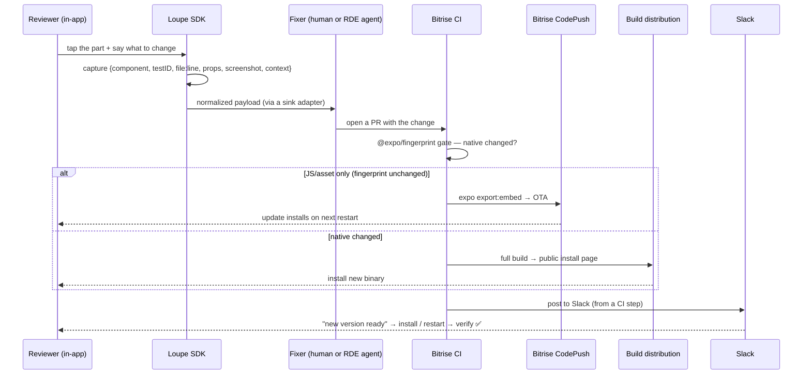

# Loupe — high-level architecture

How the whole iterate-in-production loop fits together. For the researched rationale behind each choice, see [`docs/design/`](./design); this doc is the map.

## The loop

## Components

| Layer | Piece | Role | Deep-dive |
|---|---|---|---|
| **Mobile** | Loupe SDK (`src/loupe`) | Capture: bubble → inspect → freeze → annotate → payload → sink | [mobile-architecture](./mobile-architecture.md), [capture](./design/screenshot-feedback-capture.md) |
| **Build-time** | `babel-plugin-loupe-source` + `@expo/fingerprint` | Inject the source anchor; hash the native layer for routing | [capture](./design/screenshot-feedback-capture.md), [CI](./design/bitrise-ci-pipeline.md) |
| **Fix compute** | Bitrise RDE | Where feedback becomes a PR — a human via remote access, or a Claude Code agent | [architecture](./design/bitrise-codepush-rde-architecture.md), [security](./design/feedback-agent-security.md) |
| **Release** | Bitrise CI + CodePush + build distribution | The fingerprint gate routes to OTA or a full build | [CI pipeline](./design/bitrise-ci-pipeline.md) |
| **Delivery** | Static `iterations.json` + **Slack** | In-app iterations list + new-version alerts in Slack — **no backend** | [iterations & notifications](./design/iterations-and-notifications.md) |

## Three load-bearing ideas

1. **The fingerprint is the release router.** `@expo/fingerprint` hashes the native layer. Unchanged ⇒ the JS is compatible with the installed binary ⇒ **CodePush OTA**. Changed ⇒ **full CI build + reinstall**. This keeps you inside App Store / Play OTA policy by construction. → [CI pipeline](./design/bitrise-ci-pipeline.md)

2. **The sink is pluggable: human *or* AI.** One normalized payload; a sink adapter routes it to a tracker (Linear/Jira/GitHub/Slack) or to an AI coding agent running in an RDE that opens a PR. Chosen per feedback category, never by the reviewer. → [Bitrise architecture](./design/bitrise-codepush-rde-architecture.md)

3. **Backend-optional.** For an early-stage team the iterations list is a static manifest the CI writes, and **new-version alerts are Slack messages from a CI step** — one channel for both OTA and native releases, and **no server, database, or push service** until you need per-user targeting, metrics, or private distribution. → [iterations & notifications](./design/iterations-and-notifications.md)

## Vendor posture

**Expo is the framework; Bitrise is the infrastructure.** The app is a normal Expo (prebuild/CNG) app — no EAS Build, no Expo Updates, no Expo push. OTA rides the open CodePush client (`@bitrise/code-push-sdk`); builds and distribution run on Bitrise CI; the fix-it environment is Bitrise RDE. Nothing here needs Expo's cloud. → [Bitrise architecture](./design/bitrise-codepush-rde-architecture.md)

## Security, right-sized

Blast radius is small for a founding team, so the default is a **6-control prototype baseline** (agent holds no release secrets; human eyeballs the diff; rollback ready; no committed secrets; agent cost cap; feedback treated as data). Explicit tripwires graduate you to the hardened model when you get external testers, real user data, or non-founder release rights. → [security model](./design/feedback-agent-security.md)

## Setup

The [`bitrise-setup-loupe` skill](../.claude/skills/bitrise-setup-loupe/SKILL.md) automates the Bitrise side end to end: CodePush deployments → app config → CI workflows → RDE template → first build → deliver.
