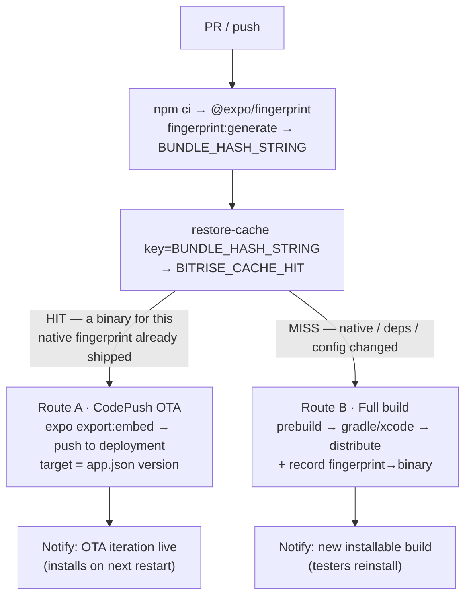

# The fingerprint gate — concrete `bitrise.yml`

*The CI implementation of the [Bitrise-native architecture](./bitrise-codepush-rde-architecture.md): one delivery workflow per platform that routes a change to **Bitrise CodePush (OTA)** or a **full CI build + distribution**, decided by `@expo/fingerprint`.*

> **This is a drop-in extension of your existing `bitrise.yml`, not a rewrite.** Your `build_android_fingerprint` / `build_ios_fingerprint` workflows already compute the exact signal this needs. The only change: on a fingerprint **HIT** (native unchanged) you ship the JS **over-the-air via CodePush** instead of swapping the bundle into a cached binary; on a **MISS** (native changed) you build and **distribute a new binary**. Written against your current setup — `format_version: "23"`, `project_type: react-native`, Node 22.23.1, Expo SDK 54 / RN 0.81.5, entry `index.ts`, step versions and stacks as in your file.

---

## 1. The routing = your existing HIT/MISS, repurposed

Your repo already proves that `@expo/fingerprint` cleanly separates JS-only changes from native ones (that's the whole caching demo). The delivery pipeline reuses that verdict as the **OTA-vs-rebuild router**:



`BITRISE_CACHE_HIT == "true"` means "we have already built (and distributed) a binary whose native fingerprint matches this commit" → the installed app is ABI-compatible with a fresh JS bundle → **CodePush is safe**. `false` means the native layer moved → **CodePush would mismatch the binary** → must rebuild. This is the same invariant Apple DPLA §3.3.2 / Google Play require, enforced by your own fingerprint.

---

## 2. Prerequisites (one-time)

- **App configured for CodePush** — `@bitrise/code-push-sdk` config plugin in `app.json` with the deployment key + `https://<workspace-slug>.codepush.bitrise.io`, then `npx expo prebuild` (see the [architecture doc §3.1](./bitrise-codepush-rde-architecture.md#31-wiring-bitrise-codepush-into-an-expo-app)). *(Your `app.json` still has a leftover `extra.eas.projectId` — harmless, unused in a Bitrise-only setup; remove it when you drop EAS.)*
- **Bitrise Secrets** (Workspace/App secrets, not in `bitrise.yml`): `CODEPUSH_API_TOKEN` (for the CodePush CLI), `NOTIFY_WEBHOOK_URL` (your notifier that fans out to FCM/APNs), and — for the iOS **native** route only — an Apple service connection + signing cert + provisioning profile.
- **A CodePush deployment** named to match `CODEPUSH_DEPLOYMENT` below (e.g. `Staging`).

---

## 3. The `bitrise.yml` additions

### 3.1 App envs + trigger map

```yaml
app:
  envs:
    - CODEPUSH_DEPLOYMENT: Staging   # which CodePush deployment JS-only PRs release to

trigger_map:
  # A PR is where a reviewer's feedback lands as a change → decide OTA vs build per platform.
  - pull_request_target_branch: "*"
    pipeline: deliver            # runs both platforms (see §3.4); or point at deliver_android
  - push_branch: main
    pipeline: deliver
```

### 3.2 `deliver_android` — the gate, fully worked

Mirrors your `build_android_fingerprint` up to `restore-cache`, then branches on `BITRISE_CACHE_HIT`.

```yaml
workflows:
  deliver_android:
    summary: |
      Fingerprint-gated delivery. JS-only change (fingerprint HIT) → Bitrise CodePush OTA.
      Native/deps/config change (MISS) → full APK build + distribute to testers.
    steps:
      - git-clone@8: {}
      - restore-npm-cache@3: {}
      - npm@3:
          title: npm ci
          inputs:
            - command: ci
      - save-npm-cache@1: {}
      - script@1:
          title: Fingerprint native layer → routing key (@expo/fingerprint)
          inputs:
            - content: |-
                #!/usr/bin/env bash
                set -euo pipefail
                # Same signal as your build_*_fingerprint workflows: JS-only keeps the hash,
                # native/deps/config busts it.
                HASH="$(npx @expo/fingerprint fingerprint:generate | jq -r '.hash')"
                envman add --key BUNDLE_HASH_STRING --value "build-fingerprint-android-${HASH}"
                # CodePush targets by store (semver) version — read it from app.json.
                envman add --key APP_VERSION --value "$(node -p "require('./app.json').expo.version")"
                echo "Native fingerprint: ${HASH} | app version: $(node -p "require('./app.json').expo.version")"
      - restore-cache@3:
          title: Has a binary already shipped for this native fingerprint?
          inputs:
            - key: $BUNDLE_HASH_STRING

      # ============ ROUTE A · fingerprint HIT = JS/asset-only = ship OTA (no rebuild) ============
      - script@1:
          title: "[ota] Build JS bundle + release to Bitrise CodePush"
          run_if: '{{ not (enveq "BITRISE_CACHE_HIT" "false") }}'
          inputs:
            - content: |-
                #!/usr/bin/env bash
                set -euo pipefail
                echo "Fingerprint HIT → native unchanged → shipping JS over-the-air."

                # Exactly the bundle the native app embeds (Hermes bytecode) — same command your
                # HIT path already uses, just aimed at a CodePush upload dir instead of an APK.
                mkdir -p _codepush/android
                npx expo export:embed \
                  --platform android \
                  --dev false \
                  --bytecode \
                  --entry-file index.ts \
                  --bundle-output _codepush/android/index.android.bundle \
                  --assets-dest _codepush/android

                # Upload to the deployment, targeting the live binary's version. Bitrise CodePush CLI
                # plugin; authenticates via $CODEPUSH_API_TOKEN.  ⚠️ confirm exact flags on the beta CLI.
                bitrise :codepush push \
                  --platform android \
                  --deployment "$CODEPUSH_DEPLOYMENT" \
                  --app-version "$APP_VERSION" \
                  --bundle _codepush/android
                # (Alternative documented path: the release-management-recipes
                #  api/upload_code_push_package.sh script with the same inputs.)
      - script@1:
          title: "[ota] Notify testers: new OTA iteration live"
          run_if: '{{ not (enveq "BITRISE_CACHE_HIT" "false") }}'
          inputs:
            - content: |-
                #!/usr/bin/env bash
                set -euo pipefail
                # No native CodePush webhook exists, so the workflow emits the signal itself.
                curl -fsS -X POST "$NOTIFY_WEBHOOK_URL" -H 'content-type: application/json' -d "{
                  \"type\":\"ota\",\"platform\":\"android\",\"deployment\":\"$CODEPUSH_DEPLOYMENT\",
                  \"appVersion\":\"$APP_VERSION\",\"buildUrl\":\"$BITRISE_BUILD_URL\"}"

      # ============ ROUTE B · fingerprint MISS = native change = build + distribute ============
      - script@1:
          title: "[native] Expo prebuild (Android)"
          run_if: '{{ enveq "BITRISE_CACHE_HIT" "false" }}'
          inputs:
            - content: |-
                #!/usr/bin/env bash
                set -euo pipefail
                echo "Fingerprint MISS → native/deps changed → full build + redistribute."
                npx expo prebuild --platform android --no-install
      - gradle-runner@5:
          title: "[native] Build Android APK (assembleRelease)"
          run_if: '{{ enveq "BITRISE_CACHE_HIT" "false" }}'
          inputs:
            - build_root_directory: android
            - gradle_task: assembleRelease
            - gradlew_path: gradlew
      - script@1:
          title: "[native] Stage APK + register fingerprint→binary (for future OTA routing)"
          run_if: '{{ enveq "BITRISE_CACHE_HIT" "false" }}'
          inputs:
            - content: |-
                #!/usr/bin/env bash
                set -euo pipefail
                mkdir -p _nativecache
                APK="$(ls android/app/build/outputs/apk/release/*.apk | head -1)"
                cp "$APK" _nativecache/app-release.apk
                echo "$APP_VERSION" > _nativecache/appversion.txt   # what CodePush should target next
                cp "$APK" "$BITRISE_DEPLOY_DIR/app-release.apk"
      - save-cache@1:
          title: "[native] Register this fingerprint as shipped"
          run_if: '{{ enveq "BITRISE_CACHE_HIT" "false" }}'
          inputs:
            - key: $BUNDLE_HASH_STRING
            - paths: _nativecache
      - deploy-to-bitrise-io@2:
          title: "[native] Distribute APK to testers (public install page)"
          run_if: '{{ enveq "BITRISE_CACHE_HIT" "false" }}'
          inputs:
            - is_enable_public_page: "true"
            - notify_user_groups: testers      # ⚠️ confirm input spelling / your tester group name
      - script@1:
          title: "[native] Notify testers: new installable build"
          run_if: '{{ enveq "BITRISE_CACHE_HIT" "false" }}'
          inputs:
            - content: |-
                #!/usr/bin/env bash
                set -euo pipefail
                curl -fsS -X POST "$NOTIFY_WEBHOOK_URL" -H 'content-type: application/json' -d "{
                  \"type\":\"build\",\"platform\":\"android\",\"appVersion\":\"$APP_VERSION\",
                  \"installUrl\":\"$BITRISE_PUBLIC_INSTALL_PAGE_URL\",\"buildUrl\":\"$BITRISE_BUILD_URL\"}"
    meta:
      bitrise.io:
        stack: ubuntu-noble-24.04-bitrise-2025-android
        machine_type_id: g2.linux.large
```

### 3.3 `deliver_ios` — same gate, one real difference

The **OTA route is identical** (just `--platform ios`, `main.jsbundle`). The **native route differs from your caching demo**: your `build_ios_fingerprint` builds a *simulator* `.app` (unsigned) — fine for the cache trick, but **it can't install on real devices**. Tester distribution needs a **signed device archive**, so the MISS path swaps `xcode-build-for-simulator` for `xcode-archive` + code signing.

```yaml
  deliver_ios:
    steps:
      # … identical prefix: git-clone@8, restore-npm-cache@3, npm ci, save-npm-cache@1,
      #    the @expo/fingerprint script (BUNDLE_HASH_STRING="build-fingerprint-ios-${HASH}"),
      #    restore-cache@3 …

      # ROUTE A · OTA — same as Android with iOS flags:
      - script@1:
          title: "[ota] Build JS bundle + release to Bitrise CodePush"
          run_if: '{{ not (enveq "BITRISE_CACHE_HIT" "false") }}'
          inputs:
            - content: |-
                #!/usr/bin/env bash
                set -euo pipefail
                mkdir -p _codepush/ios
                npx expo export:embed --platform ios --dev false --bytecode \
                  --entry-file index.ts \
                  --bundle-output _codepush/ios/main.jsbundle --assets-dest _codepush/ios
                bitrise :codepush push --platform ios \
                  --deployment "$CODEPUSH_DEPLOYMENT" --app-version "$APP_VERSION" --bundle _codepush/ios
      # … + the same [ota] notify script …

      # ROUTE B · native — signed DEVICE archive (not simulator) so testers can install:
      - script@1:
          title: "[native] Expo prebuild (iOS)"
          run_if: '{{ enveq "BITRISE_CACHE_HIT" "false" }}'
          inputs:
            - content: |-
                #!/usr/bin/env bash
                set -euo pipefail
                npx expo prebuild --platform ios --no-install
      - cocoapods-install@3:
          run_if: '{{ enveq "BITRISE_CACHE_HIT" "false" }}'
          inputs:
            - source_root_path: $BITRISE_SOURCE_DIR/ios
      - manage-ios-code-signing@3:            # pulls cert + provisioning from your Apple connection
          run_if: '{{ enveq "BITRISE_CACHE_HIT" "false" }}'
          inputs:
            - distribution_method: ad-hoc
      - xcode-archive@5:
          title: "[native] Archive signed .ipa"
          run_if: '{{ enveq "BITRISE_CACHE_HIT" "false" }}'
          inputs:
            - distribution_method: ad-hoc
      - save-cache@1:
          run_if: '{{ enveq "BITRISE_CACHE_HIT" "false" }}'
          inputs:
            - key: $BUNDLE_HASH_STRING
            - paths: _nativecache      # write appversion.txt here like Android
      - deploy-to-bitrise-io@2:
          run_if: '{{ enveq "BITRISE_CACHE_HIT" "false" }}'
          inputs:
            - is_enable_public_page: "true"
            - notify_user_groups: testers
      # … + the same [native] notify script …
    meta:
      bitrise.io:
        stack: osx-xcode-16.4.x
        machine_type_id: g2.mac.large
```

**iOS caveats:** device install needs **Development/Ad-hoc/Enterprise** provisioning (public-page OTA install); testers' UDIDs must be in the ad-hoc profile. The OTA route needs **no signing** (it's just JS). Keep `newArchEnabled: true` in mind — `@bitrise/code-push-sdk` supports the New Architecture, but smoke-test the swap once.

### 3.4 Running both platforms — a pipeline

```yaml
pipelines:
  deliver:
    stages:
      - gate: {}
  # or, simplest: a stage that runs both workflows in parallel
  deliver_both:
    workflows:
      - deliver_android: {}
      - deliver_ios: {}
```

This is also where the earlier three-workflow naming maps on: **`fingerprint_gate`** = the fingerprint + `restore-cache` prefix; **`codepush_release`** = Route A; **`build_and_distribute`** = Route B. They're expressed here as `run_if`-gated stages inside one workflow (matching your existing single-workflow HIT/MISS style); split them into separate pipeline stages if you prefer isolation and per-stage stacks.

---

## 4. Assumptions & what to verify once the Bitrise MCP is authenticated

| Item | Status | Verify with |
|---|---|---|
| CodePush CLI invocation (`bitrise :codepush push` flags) | **flagged** — beta CLI, exact flags unconfirmed | CodePush CLI docs; a dry-run in an RDE |
| `deploy-to-bitrise-io@2` inputs (`is_enable_public_page`, `notify_user_groups`) | high-confidence public step inputs | `step_inputs` for `deploy-to-bitrise-io` |
| `manage-ios-code-signing@3` / `xcode-archive@5` versions | current major versions | `get_bitrise_yml` on a signed iOS app you already have |
| Your CI stacks / machine types | using the ones from your file | `list_available_stacks` |
| CodePush deployment name + key | placeholder `Staging` | `codepush_list_deployments(app_id)` |
| "HIT ⇒ a distributed binary exists" | heuristic (cache = built+shipped) | harden by writing the shipped app version into the registry on MISS and reading it on HIT |

**One edge case to close:** a cache HIT means a binary was *built* for that fingerprint, not provably *distributed*. In production, gate Route A on "a binary for this fingerprint was actually released" — the `appversion.txt` you cache on MISS is the hook; extend it to a small `fingerprint → {appVersion, released:true}` registry (a cached JSON or a CodePush deployment note) and check `released` before choosing OTA.

---

## 5. Why this fits your repo specifically

You already built the hard part. `build_android_fingerprint` / `build_ios_fingerprint` / `build_ios_cache_fingerprint` demonstrate that `@expo/fingerprint` reliably tells JS-only from native changes and that `expo export:embed` reproduces the embedded bundle. This pipeline changes only the *destination* of that verdict: instead of "swap the bundle into a cached binary to prove the cache works," it's "swap over-the-air via CodePush (HIT) or ship a new signed binary (MISS)." The fingerprint stops being a caching optimization and becomes the **release router** for the whole feedback→iteration loop.

*Sources: your `bitrise.yml`; [architecture doc](./bitrise-codepush-rde-architecture.md); Bitrise CodePush [CI releasing](https://docs.bitrise.io/en/release-management/codepush/codepush-updates-with-bitrise-ci) + [CLI](https://docs.bitrise.io/en/release-management/codepush/codepush-cli/about-the-codepush-cli); [build distribution](https://docs.bitrise.io/en/release-management/build-distribution/distributing-builds-to-testers). Beta CLI flags and step input spellings to confirm once the Bitrise MCP is authenticated.*
