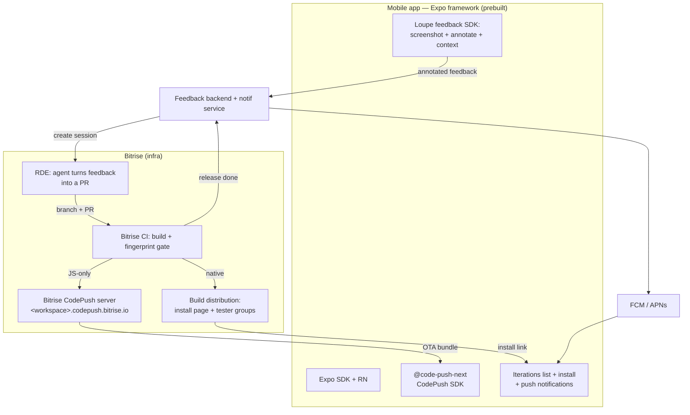
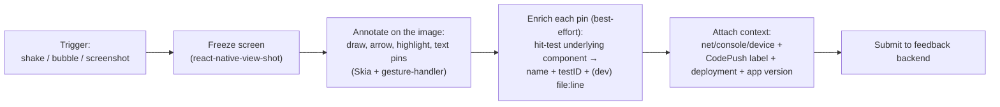
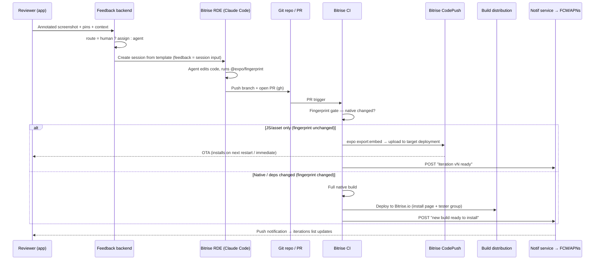
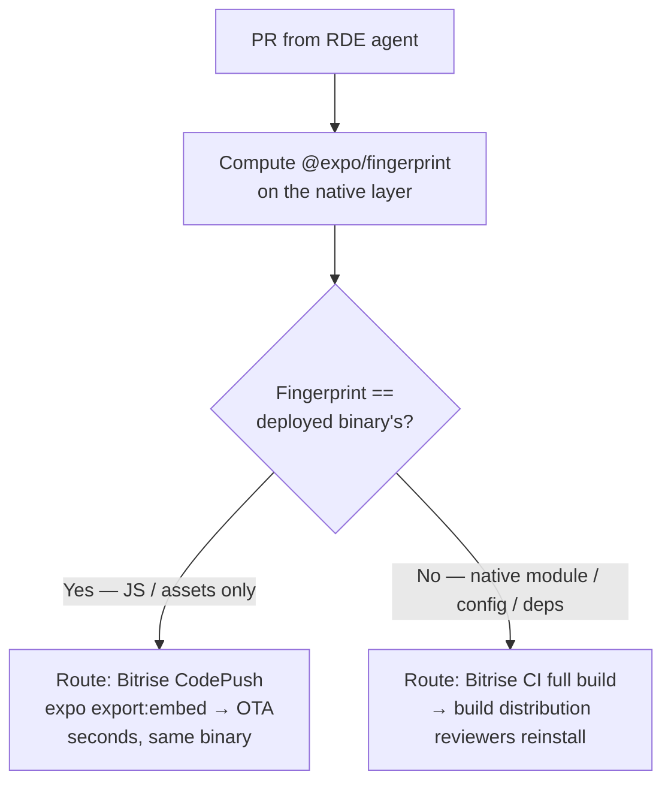

# Bitrise-native in-app iteration — Expo as framework, Bitrise as infra

*A no-Expo-cloud implementation of the [in-app iteration framework](./in-app-iteration-framework.md): the app is built with **Expo (framework only)**, but OTA, builds, distribution, and the feedback→fix compute all run on **Bitrise CodePush + Bitrise CI + Bitrise RDE**. No EAS Build, no EAS Update, no Expo push service.*

> Companion to `in-app-iteration-framework.md`. That doc covers the vendor-neutral framework and the client-side capture internals (Babel source injection, component anchoring). **This doc replaces its OTA/backend layer with a Bitrise stack** and adds the mobile features and the RDE setup skill you asked for.

---

## 1. Positioning — "Expo as framework, Bitrise as infra"

The lock-in worth avoiding isn't Expo the framework — it's Expo the *cloud* (EAS Build, EAS Update, Expo's push service). This design keeps Expo purely as the app framework via **Continuous Native Generation** (`expo prebuild`) and moves every piece of infrastructure to Bitrise:

| Concern | ❌ Expo cloud | ✅ This design (Bitrise) |
|---|---|---|
| App framework | Expo SDK | **Expo SDK (unchanged)** |
| Native project | managed | **`expo prebuild` (CNG) — you own `ios/` + `android/`** |
| OTA updates | EAS Update (`expo-updates`) | **Bitrise CodePush** (`@bitrise/code-push-sdk`) |
| Builds | EAS Build | **Bitrise CI** |
| Distribution | EAS internal distribution | **Bitrise build distribution** (public install page + tester groups) |
| Feedback→fix compute | — | **Bitrise RDE** (cloud agent env) |
| Push notifications | Expo push service | **FCM/APNs direct** (RN Firebase) |

**Honest caveat:** Bitrise CodePush and Bitrise RDE are *also* hosted vendor services, both in **beta** (CodePush GA planned 2026; RDE self-serve beta since June 2026). So this is "one vendor instead of two," not "zero lock-in." What genuinely lowers lock-in: the OTA **client SDK is the open CodePush API** (portable to any CodePush-compatible server — RevoPush, self-hosted, etc.), and the app itself is plain prebuilt RN you can build anywhere. If a team already uses Bitrise CI, this adds **no new vendor at all**.

**Mutual-exclusivity note:** you use **either** `expo-updates` **or** CodePush, never both. This design omits `expo-updates` entirely.

---

## 2. System overview



Two independent control planes: **CodePush** (JS/asset OTA, seconds) and **CI build distribution** (native binaries, minutes + reinstall). The **fingerprint gate** decides which one a given change takes.

---

## 3. Mobile app (Expo framework)

### 3.1 Wiring Bitrise CodePush into an Expo app

CodePush is a **native module** → it cannot run in **Expo Go**; you use CNG + a custom build.

1. `app.json`: make `ios.bundleIdentifier` / `android.package` match the Bitrise apps.
2. `npm install @bitrise/code-push-sdk` — ✅ **resolved against the npm registry (Aug 2026):** two CodePush client packages exist and this is the one to use. **`@bitrise/code-push-sdk` is Bitrise's official SDK** — actively published and maintained by ~7 Bitrise engineers, latest **v10.5.1 (Jul 16 2026)**. The Bitrise *docs page* currently still instructs the community fork **`@code-push-next/react-native-code-push`** (v10.4.2, whose repo lives under the **`codemagic-ci-cd`** org — a competitor's fork lineage, no Bitrise involvement). Both speak the CodePush protocol against the same server, but prefer the Bitrise-maintained package. ⚠️ One thing to confirm once authenticated: that the Bitrise CodePush **server** doesn't hard-expect the `@code-push-next` client — if docs and SDK disagree, the server's expectation wins.
3. Add the Expo config plugin:
```json
{ "plugins": [
  ["@bitrise/code-push-sdk/expo", {
    "ios":     { "CodePushDeploymentKey": "<STAGING_KEY>", "CodePushServerURL": "https://<workspace-slug>.codepush.bitrise.io" },
    "android": { "CodePushDeploymentKey": "<STAGING_KEY>", "CodePushServerURL": "https://<workspace-slug>.codepush.bitrise.io" }
  }]
]}
```
4. `npx expo prebuild` (writes `CodePushDeploymentKey`/`CodePushServerURL` into `Info.plist` + `strings.xml`, patches `AppDelegate.swift` / `MainApplication.kt`), then `npx expo customize metro.config.js`.
5. Wrap the root with `codePush(App)` and call `codePush.sync({ ... })`.

Notes that matter: **deployment keys are not secrets** (they ship as plain strings in the binary — don't treat them as credentials); Android's key is `CodePushServerUrl` (different casing from iOS `CodePushServerURL`); a **runtime `codePush.sync({ deploymentKey })` overrides the embedded key** — this is what lets one binary hop between channels (used by the iterations list, §3.3).

### 3.2 Screenshot-first feedback (your explicit ask)

The primary capture is the classic, non-technical-friendly **screenshot + annotate** flow — enriched, because this is RN, with an optional component anchor (the [moat from the framework doc](./in-app-iteration-framework.md#22-why-react-native-changes-the-game)).



- **Baseline (works in any build):** the reviewer draws directly on a frozen screenshot and drops comment pins at pixel coordinates — exactly the Instabug/Shake mental model, which non-technical users already understand.
- **Enrichment (dev/preview/instrumented builds):** each pin's coordinate is hit-tested to the underlying React component, attaching `{component, testID, file:line}` so the downstream agent gets a precise target instead of a pixel. Degrades silently to coordinates-only in release builds.
- **Every report is stamped with the exact `CodePush.getUpdateMetadata()` label + deployment + store version** it came from — so a fix targets the right binary/bundle.

Packages: `react-native-view-shot`, `@shopify/react-native-skia`, `react-native-gesture-handler`, `react-native-network-logger`, `expo-device`/`expo-constants`, the CodePush SDK's `getUpdateMetadata()`.

### 3.3 Iterations list + install any + notifications

A dedicated in-app screen shows a **unified timeline of iterations**, merging two sources the backend aggregates:

| Iteration type | Source (backend) | "Install" action on device |
|---|---|---|
| **OTA update** (JS/asset) | CodePush `list_updates` per deployment (label, description, rollout, target version, metrics) | `codePush.sync({ deploymentKey, installMode: IMMEDIATE })` pointed at that iteration's channel → download + restart |
| **Native build** | Bitrise `list_installable_artifacts` / build distribution | open the **public install page** (URL + QR) to install the binary |

**Installing an *arbitrary* JS iteration** (not just "latest") is the one place CodePush's model needs a pattern: a deployment serves its *latest enabled* release for a matching target version, so to let a reviewer jump to any past/other iteration, give each shareable iteration its **own lightweight deployment** (or a rotating "preview" deployment you promote a chosen label into), and switch the app to it at runtime via `sync({ deploymentKey })`. The list effectively becomes a **channel switcher** backed by per-iteration deployment keys the backend hands down.

**Notifications on new versions:**
- **Provider (anti-lock-in):** use **FCM + APNs directly** via `@react-native-firebase/messaging` (config-plugin friendly under prebuild) rather than Expo's push service. `expo-notifications` is usable but its convenient remote-push path is Expo infra — avoid it here.
- **Trigger:** Bitrise **outgoing webhooks fire on build events only** — there is **no native CodePush "release published" webhook**. So the notification is emitted by the **CI release workflow's final step**, which POSTs to your notification service after a successful CodePush upload (or native deploy); the service fans out FCM/APNs. Bitrise **tester-group emails** are a second, built-in channel for *native* builds (one-time email with an install link).

---

## 4. Backend — the feedback→ship pipeline

### 4.1 RDE as the feedback-processing environment

Bitrise **RDE** is a CI-identical, disposable macOS/Linux box created from a **template**. Bitrise has already published essentially this exact pattern — ["a coding agent that lives in Slack"](https://bitrise.io/blog/post/how-we-built-a-coding-agent-that-lives-in-slack-and-the-recipe-to-build-your-own): per-task isolated session, warmup installs Claude Code + a push-only git identity, an orchestrator drives the agent through the RDE MCP server (typing into a **tmux** pane), the agent opens a PR with `gh`, and the session self-deletes on merge.



RDE constraints to design around (all beta-era): the **MCP `execute` call has a 2-minute timeout** → run real RN builds (`prebuild`, `pod install`, `gradle`) in a **persistent tmux pane** and poll, never in one blocking call; sessions **auto-terminate when idle** (treat them as ephemeral, restore/recreate); the **exact stack list and `@expo/fingerprint`/`expo prebuild` availability aren't documented** → pin a macOS stack and smoke-test once.

### 4.2 The fingerprint gate (this repo *is* the decision engine)



`@expo/fingerprint` hashes the native dependency graph + config. If a PR leaves that hash unchanged, it's provably JS/asset-only and **safe to ship via CodePush**; if the hash moves, CodePush would mismatch the installed binary, so it **must** go through a full CI build. This is the same fingerprint signal `expo-build-fingerprint-demo` already computes for build caching — here it becomes the **automated router** between the two control planes, and the CodePush **target-binary-version** is set from the last native build's version so OTA only reaches compatible binaries.

### 4.3 Bitrise CI workflows (`bitrise.yml` sketch)

Three workflows + a trigger map (author via `get_bitrise_yml` → edit → `validate_bitrise_yml` → `update_bitrise_yml`):

- **`fingerprint_gate`** — install JS deps, `npx expo prebuild --no-install` (or restore native state), compute `@expo/fingerprint`, compare to the recorded deployed fingerprint, set an env var `ROUTE=codepush|build`, branch the pipeline.
- **`codepush_release`** — `npx expo export:embed` → zip the bundle+assets (≤50 MB) → upload to the target deployment via the `release-management-recipes` script (`api/upload_code_push_package.sh`) or `bitrise :codepush push --bundle --platform … --deployment Staging --app-version …` → final `script` step POSTs the notification.
- **`build_and_distribute`** — full native build → **Deploy to Bitrise.io** → enable public install page / notify tester group → final `script` step POSTs the notification.
- **Trigger map:** Bitrise's sample fires CodePush on a **PR to the `updates` branch carrying the `release-update` label**; native PRs run `build_and_distribute`. The fingerprint gate can apply/verify that label automatically.

### 4.4 Distribution specifics (native route)

- **iOS:** IPA with **Development / Ad-hoc / Enterprise** provisioning, installed over-the-air from the **public install page** (URL + QR, optional expiry + access code; only workspace owners/managers/project-admins can enable it).
- **Android:** **APK only** — **AAB cannot be distributed** to testers this way.
- **Tester groups:** toggle "Send notifications automatically"; each member gets a **one-time** email with the install link when a new artifact lands (members added later don't get the past notice).

---

## 5. The setup skill (backend, RDE-driven)

A Claude Code **skill** that bootstraps the entire backend for a repo in one run. It orchestrates the Bitrise MCP tools (all confirmed to exist) + RDE.

**`SKILL.md` (skeleton)**
```markdown
---
name: setup-inapp-iteration
description: Bootstrap Bitrise CodePush + CI + RDE for an Expo(prebuild) RN app so
  non-technical reviewers can give in-app feedback and receive OTA/build iterations.
  Use when a user says "set up in-app iteration / CodePush + RDE for <app>".
---
Inputs: app slug (or create), workspace slug, platforms, deployment names,
        machine type/stack, notification target (Slack/FCM), route policy.
Steps: preflight → deployments → app config → CI workflows → RDE template →
       distribution + notifications → first build → deliver.
```

| # | Step | Bitrise tools / commands |
|---|---|---|
| 1 | **Preflight** — identify the app + workspace; create if missing | `me`, `list_apps`, `get_app` / `register_app`, `create_connected_app` |
| 2 | **CodePush deployments** — Staging + Production (or per-reviewer preview); capture keys + `https://<ws>.codepush.bitrise.io` | `codepush_create_deployment`, `codepush_list_deployments` |
| 3 | **Configure the app** — add `@code-push-next` plugin + keys to `app.json`, `npm i`, `expo prebuild`, `expo customize metro.config.js` (run inside the RDE) | `bitrise_devenv_execute` (tmux), `bitrise_devenv_upload` |
| 4 | **CI workflows** — inject `fingerprint_gate` / `codepush_release` / `build_and_distribute` + trigger map | `get_bitrise_yml`, `validate_bitrise_yml`, `update_bitrise_yml`, `register_webhook` |
| 5 | **RDE template** — macOS stack, machine type; warmup installs Claude Code + git-only SSH key (saved input) + node deps + tmux; startup idempotent; session inputs (repo, feedback payload, deployment) | `bitrise_devenv_list_stacks`, `bitrise_devenv_list_machine_types`, `bitrise_devenv_create_template`, `bitrise_devenv_create_saved_input` |
| 6 | **Distribution + notifications** — tester group (auto-notify) + outgoing webhook + register the notif-service endpoint the release workflow POSTs to | `create_tester_group`, `add_testers_to_tester_group`, `create_outgoing_webhook` |
| 7 | **First build** — trigger `build_and_distribute`, poll, get the install page/artifact | `trigger_bitrise_build`, `get_build`, `list_installable_artifacts`, `set_installable_artifact_public_install_page` |
| 8 | **Deliver** — send the install link + summary (keys, template id, workflow ids) to the user | notify tester group / push |

The **same RDE template** created in step 5 is what the runtime pipeline (§4.1) instantiates per feedback item — setup and runtime share one environment definition.

---

## 6. Risks & flags (carry these into implementation)

- **CodePush SDK package name** — ✅ resolved: use Bitrise's official **`@bitrise/code-push-sdk`** (npm v10.5.1, Bitrise-maintained), not the docs' `@code-push-next/react-native-code-push` (community fork under the `codemagic-ci-cd` org). Only open question: whether the CodePush server hard-expects a specific client — verify once authenticated.
- **Both Bitrise products are beta** — CodePush (GA 2026, no dedicated UI yet, no CodePush Step — release via script/recipes/CLI) and RDE (APIs can break without notice; prefer CLI/MCP over the "experimental" REST API). Pin versions.
- **RDE `execute` 2-min timeout** — use tmux/async for builds; **auto-terminate** → ephemeral sessions.
- **No CodePush webhook** — notifications come from the CI workflow's final step, not a platform event.
- **Distribution limits** — Android APK only (no AAB); iOS needs proper provisioning + public install page.
- **Deployment keys aren't secrets**; **"install any" needs per-iteration deployments** (CodePush serves latest-per-channel).
- **Untrusted input** — annotated feedback is attacker-controllable; enforce agent guardrails at the **tool layer** (which repos, which branches, human approval before merge/native release), as the Slack-agent reference does. Never auto-merge; CodePush **rollback** + rollout % are the safety net.
- **Fingerprint accuracy** — compute `@expo/fingerprint` against real native state on a CI-matching RDE stack; a wrong "JS-only" verdict could ship an incompatible OTA (mitigated by CodePush target-binary-version gating).

---

## 7. Phased rollout

1. **Manual spine** — hand-create one CodePush deployment + a `codepush_release` workflow; ship a JS change via `expo export:embed` from CI; confirm a device gets it. *Proves the OTA path with Expo-as-framework.*
2. **Fingerprint gate** — add `@expo/fingerprint` compare → auto-route CodePush vs build. *Proves the router (this repo's core).*
3. **Mobile features** — screenshot-annotate feedback + iterations list + FCM/APNs notifications.
4. **RDE agent** — feedback → RDE session → PR (start with human-in-the-loop merge). Then the `setup-inapp-iteration` skill to make it one-command.
5. **Polish** — per-iteration preview deployments, component-anchor enrichment, rollback UX, metrics dashboard (`codepush_get_metrics`).

---

## 8. Sources

- Bitrise CodePush: [about](https://docs.bitrise.io/en/release-management/codepush/about-codepush) · [configuring your app](https://docs.bitrise.io/en/release-management/codepush/configuring-your-app-for-codepush) · [deployments](https://docs.bitrise.io/en/release-management/codepush/creating-a-codepush-deployment) · [releasing updates](https://docs.bitrise.io/en/release-management/codepush/creating-and-releasing-codepush-updates) · [releasing from CI](https://docs.bitrise.io/en/release-management/codepush/codepush-updates-with-bitrise-ci) · [CLI](https://docs.bitrise.io/en/release-management/codepush/codepush-cli/about-the-codepush-cli) · [code signing](https://docs.bitrise.io/en/release-management/codepush/code-signing-with-codepush) · [beta announcement](https://bitrise.io/blog/post/introducing-codepush-beta-ship-react-native-updates-in-minutes) · [SDK repo](https://github.com/bitrise-io/react-native-code-push)
- Bitrise RDE: [overview](https://docs.bitrise.io/en/bitrise-rde/getting-started/remote-dev-environments-overview) · [templates](https://docs.bitrise.io/en/bitrise-rde/configuration/templates) · [MCP server](https://docs.bitrise.io/en/bitrise-rde/rde-options/bitrise-rde-mcp-server) · [beta launch](https://bitrise.io/blog/post/bitrise-remote-dev-environments-beta-launch) · [Slack coding-agent reference architecture](https://bitrise.io/blog/post/how-we-built-a-coding-agent-that-lives-in-slack-and-the-recipe-to-build-your-own)
- Bitrise CI: [build distribution](https://docs.bitrise.io/en/release-management/build-distribution/distributing-builds-to-testers) · [tester groups](https://docs.bitrise.io/en/release-management/build-distribution/tester-groups) · [triggering builds API](https://docs.bitrise.io/en/api/triggering-and-aborting-builds.html) · [outgoing webhooks](https://docs.bitrise.io/en/bitrise-platform/integrations/webhooks/adding-outgoing-webhooks)
- `@expo/fingerprint` — the JS-vs-native router; see this repo (`expo-build-fingerprint-demo`).

*Bitrise CodePush and RDE were in beta as of this research (Aug 2026); confirm package names, exact CLI syntax, stack availability, and metric labels against current docs before implementation.*
