# Securing the feedback → AI-agent → OTA loop

*The trust and safety model for the [Bitrise-native architecture](./bitrise-codepush-rde-architecture.md), **right-sized to your stage.** The feedback→fix→ship loop is powerful because it is fast and unreviewed — the same property that makes a compromise costly. But how much security you need scales with your **blast radius**, and at early-stage prototyping that radius is small.*

> **If you're a founder prototyping (non-production): [§0](#0--start-here-right-size-to-your-stage) is your whole security model — six cheap controls.** §1 onward is the hardened target you grow into, with explicit tripwires ([§0](#0--start-here-right-size-to-your-stage)) for when to turn each part on. Framed as defensive engineering: keeping a mistake — or an attacker — from turning stakeholder feedback into a shipped exploit.

---

## 0. — Start here: right-size to your stage

**Security should be proportional to blast radius.** The scary framing — "a bad OTA bundle is instant code execution on every device" — is only as scary as *how many devices, whose data, and how hard to undo.* At **early-stage prototyping**, the honest picture is: your "users" are the **founding team plus a few friendly testers / design partners**, the app usually isn't holding **real customer data, auth, or payments** yet, and a bad ship is a **one-command CodePush rollback** away.

So §1–§8 below are **over-engineered for where you are.** Do this instead:

### The prototype baseline — six cheap, high-leverage controls
1. **Keep signing keys and the production CodePush token *out* of the agent's environment.** The agent *proposes*; it never holds the keys that ship to devices. Highest-value control at any stage, and it's free.
2. **Glance at the agent's *diff* before you merge/ship.** No auto-merge to the channel your testers are on. For a solo founder this is 30 seconds — and it *is* the entire "human gate."
3. **Keep rollback one command away; ship to a small tester group first.** At this stage, reversibility — not prevention — is the safety net. A bad ship is a minute to undo.
4. **Never commit secrets** — Bitrise Secrets / gitignored `.env`. Leaked keys get scraped from public repos within minutes; this is the mistake that actually bites early teams.
5. **Cap agent cost** — a hard limit on concurrent/total RDE sessions and wall-clock, so a loop or a bad actor can't run up a bill.
6. **Treat feedback as data, not instructions** — fence it in the prompt, let the agent re-derive file locations. Nearly free, and it neutralizes lazy prompt injection.

That's the whole model for now. Everything else — reviewer auth, CODEOWNERS/branch protection, SAST, provenance, PII redaction, CodePush code signing, two-person rules, egress allowlists — you can **consciously defer.** Not ignore: *defer, and know when to revisit.*

### Graduation tripwires — turn on the hardened model when ANY becomes true

| When this becomes true… | …turn on |
|---|---|
| The feedback build reaches **anyone outside the founding team / trusted partners** | Reviewer auth + internal/external split; external → human route only (§4.1) |
| The app handles **real user data, auth, payments, or regulated data** | PII redaction at capture + feedback-store access control (§4.2, §4.7) |
| You have **real production users at any scale** | CodePush code signing + staged rollout + separate Staging/Prod (§4.5–4.6) |
| **Non-founders get merge/release rights** (team grows past a few) | CODEOWNERS + branch protection + mandatory diff review + two-person prod (§4.4–4.5) |
| You **publish to the App Store / Play Store** for the public | The full model + provenance / monitoring (§4.6) |

Until a tripwire fires, the six controls above are enough. **The rest of this document is the destination, not the on-ramp** — skim it now, implement it then.

---

## 1. Why this loop is dangerous — and how much, at your stage

Three properties combine badly if left unguarded:

1. **OTA is unreviewed remote code delivery.** A malicious JS bundle on the **production CodePush channel executes on every installed device, instantly, with no store review.** The property that makes iteration fast makes a compromise catastrophic.
2. **The agent ingests attacker-controlled content.** The feedback *note* is natural language, the *screenshot* can contain adversarial text, and *network/console logs* are attacker-influenced — all classic **prompt-injection** vectors (OWASP LLM01). "Fix the button the reviewer complained about" can smuggle "…and also add this snippet / read this secret / open this URL."
3. **The agent has agency.** It edits code, pushes branches, and can influence what ships (**excessive agency**, OWASP LLM08).

The failure mode to design against is the **"lethal trifecta"**: an agent that simultaneously has (a) access to secrets/private data, (b) exposure to untrusted input, and (c) the ability to communicate externally can be turned into an exfiltration or backdoor tool. **The entire model below is organized to ensure the agent never holds all three at once.**

---

## 2. Assets, adversaries, trust boundaries

**Assets:** source-code integrity · CI + signing + CodePush credentials · **the production OTA channel (the crown jewel)** · RDE compute · secrets · end-user devices & data · the feedback store (contains PII/screenshots/logs).

**Adversaries:** an untrusted external reviewer/stakeholder (if the feedback build is shared with clients) · a compromised reviewer device · a network MITM on the feedback channel · a malicious dependency · an insider · a subverted agent session.

**The two transitions that must never be automated end-to-end:** *(i)* untrusted text → agent actions, and *(ii)* merge → production OTA. Everything hangs off protecting those two.

---

## 3. The core idea — two planes

Split the system into a **powerless "propose" plane** (touches untrusted input, holds nothing valuable) and a **trusted "release" plane** (holds secrets, is driven only by human-authorized merges). The human review gate is the only bridge.

```mermaid
flowchart LR
    subgraph U["Untrusted PROPOSE plane — powerless by construction"]
        FB["Feedback<br/>(untrusted text / image / logs)"] --> TRI["Human triage gate<br/>(which feedback becomes a task)"]
        TRI --> AG["RDE agent: ephemeral, git-only push key,<br/>NO release secrets, egress allowlist"]
        AG --> PR["PR → non-protected branch"]
    end
    subgraph G["GATE"]
        REV["Human diff review + CODEOWNERS<br/>+ SAST / secret / dependency scan + policy check"]
    end
    subgraph T["Trusted RELEASE plane — holds the secrets"]
        MERGE["Merge (human-authorized)"] --> CI["CI release stage:<br/>signing keys + CodePush token"]
        CI --> SIGN["Signed CodePush bundle / signed IPA·APK"]
        SIGN --> ROLL["Staged rollout + crash-gated auto-rollback"]
    end
    PR --> REV --> MERGE
```

The agent lives entirely in the left plane. It can *propose* anything; it can *release* nothing. This is exactly the pattern Bitrise's own ["coding agent in Slack"](https://bitrise.io/blog/post/how-we-built-a-coding-agent-that-lives-in-slack-and-the-recipe-to-build-your-own) uses — a **git-only, push-scoped SSH identity, orchestrator credentials that never touch the coding machine, and guardrails enforced as hard checks at the tool layer, not prompt text.**

---

## 4. Defense-in-depth, mapped to your stack

### 4.1 Ingress — authenticate and bound the feedback
- **Authenticate reviewers** (per-project token / SSO) and **classify** them: *internal-trusted* vs *external-stakeholder*. TLS + payload signing; strict size/rate limits and per-reviewer quotas.
- **Human triage gate before any agent runs.** Feedback does **not** auto-spawn an RDE session. A maintainer promotes selected items to agent tasks. This bounds cost/DoS and shrinks the injection surface. **External feedback defaults to the human route**, never straight to the agent.

### 4.2 Payload handling — treat everything as data, never instructions
- **Fence untrusted content** in the agent prompt (spotlighting/delimiting); harden the system prompt so feedback text can never redefine policy or tools.
- **Don't trust client-supplied `source file:line` / props.** They're advisory hints; the agent **re-derives** the target location inside the repo. A malicious client can't point the agent at arbitrary files.
- **Redact at capture:** mask secrets/PII in screenshots and scrub tokens from network/console logs (Sentry-style default-mask-all) **before** they reach storage or the agent.

### 4.3 The agent sandbox (RDE) — powerless by construction
- **Ephemeral, per-task** session from a **dedicated low-privilege template**; auto-terminate + self-delete on completion.
- **Git-only, push-scoped SSH identity** — feature branches only; **no merge rights, no GitHub API token.**
- **No release secrets in the session** — no CodePush token, no signing certs, no prod deploy creds. (Breaks leg (a) of the trifecta.) The only secret it holds is the push-scoped git key, delivered via an **RDE saved input** (encrypted, user-scoped).
- **Egress allowlist** — package registry + git host only; block arbitrary outbound. (Breaks leg (c): even if injected, it can't phone home.)
- **Tool-layer allowlist** — which commands, which paths, resource + wall-clock budget, no access to other repos. Enforced by the orchestrator, **not** by asking the model nicely.

### 4.4 Change control — the PR is the checkpoint
- Agent PRs target **non-protected branches only**. Protected branches require human review + green checks + policy pass.
- **CODEOWNERS / required review on sensitive paths** — for this repo: `bitrise.yml`, `app.json` (the CodePush plugin config), `package.json` + `package-lock.json`, `ios/`, `android/`, the Babel source-injection plugin (when added), and anything touching signing/secrets.
- **A CI policy gate** blocks or force-escalates agent PRs that touch those paths, that add/*change any dependency* (a pure-JS malicious dep can ride OTA even when the native fingerprint is unchanged — so **every dependency change gets human security review regardless of the fingerprint verdict**), or that lack provenance.
- **SAST + secret-scanning + `npm audit`** on every agent PR.
- **Mandatory human review of the diff — not the description.** A PR title can lie; the diff can't. This is the single most important control against a backdoored change.

### 4.5 Release authorization — the privileged transition
- The CI release stage (CodePush push / distribution) triggers **only on a merged, human-approved PR** — never directly on agent output. Signing keys + CodePush token live **only** here (**Bitrise Secrets**, never in `bitrise.yml` — your repo already follows this).
- **Turn on CodePush code signing** (JWT-signed bundle, public key embedded via `CodePushPublicKey`): devices then run **only your signed bundles**, defeating a hijacked-channel push.
- **Separate Staging vs Production** CodePush deployments. **External stakeholders only ever touch Staging/preview channels.** Production OTA requires a **two-person rule**.
- **"JS-only" ≠ "low-risk."** The fingerprint gate stops *native* code from going OTA, but JS *is* the entire app logic — a malicious JS diff is fully dangerous. JS-only OTA PRs get the **same** review rigor as native ones.

### 4.6 Post-release — reversibility and detection
- **Staged/percentage rollout** + **crash-gated auto-rollback** to last-known-good/embedded bundle + a manual **kill-switch** (CodePush rollback). Reversibility is the backstop when prevention fails.
- **Full provenance chain**, immutable: `feedback-id → RDE session → branch → PR → approver → build → CodePush label`. Aim at SLSA-style build provenance.
- **Alerting** on: agent PRs touching sensitive paths, anomalous RDE egress, releases outside change windows, abnormal rollout/crash metrics.

### 4.7 Secrets & data hygiene
- Bitrise **Secrets** for CI creds; RDE **saved inputs** (encrypted, user-scoped) for the git-only key; scoped, short-lived tokens; rotation on a schedule and on any suspected leak.
- Feedback store: access-controlled, encrypted, retention-limited; screenshots/logs redacted; treated as **PII** (GDPR: purpose limitation, deletion path).

---

## 5. Threat → control matrix

| Threat | Primary controls | Residual risk |
|---|---|---|
| **Prompt injection → secret exfiltration** | No secrets in agent env (breaks trifecta) · egress allowlist · fence input as data · human diff review | Injection that produces plausible-looking malicious code (caught only at review) |
| **Backdoored code merged & shipped (OTA = RCE)** | Mandatory human **diff** review · CODEOWNERS · SAST · no auto-merge · staged rollout + rollback · CodePush signing | Subverted/careless reviewer; sophisticated obfuscation |
| **Supply-chain (malicious dep / postinstall)** | Dependency changes always need human review (even JS-only) · lockfile discipline · dep allowlist · `npm audit` | Compromise of an already-trusted dependency |
| **RDE abuse / lateral movement** | Ephemeral + resource/time caps · egress allowlist · no lateral creds · auto-terminate · monitoring | Beta-platform escape (low, but RDE is beta) |
| **Production OTA channel hijack** | Release only from merged PR · signing keys only in release plane · CodePush code signing · two-person prod rule | Insider with merge + release rights |
| **Spoofed / flood feedback (DoS, cost)** | Reviewer authN · rate limits + quotas · human triage before any RDE spawn | Credentialed-insider abuse |
| **PII / secret leakage via screenshot or logs** | Redact/mask at capture · access-controlled, retention-limited store | Sensitive data in an unmasked custom view |

---

## 6. The human/AI switch is itself a security control

The earlier "route: human **or** agent, switchable" isn't just UX — it's a security dial. **External/untrusted feedback → human route by default.** The agent route is reserved for internal-trusted contexts and **always keeps a human at the merge gate.** Fully-autonomous merge-to-production is out of scope for anything reaching real users; the agent's job ends at "well-scoped PR proposal."

---

## 7. A maturity ladder (don't build it all on day one)

- **MVP / prototype (safe to switch on):** the six controls in [§0](#0--start-here-right-size-to-your-stage) — no release secrets in the agent · diff review before merge · rollback ready · no committed secrets · agent cost cap · feedback-as-data. Internal-trusted testers only. (Egress allowlist optional here; add it at the first external tripwire.)
- **Hardened (external stakeholders):** full CODEOWNERS/policy gates · SAST/secret/dep scanning · CodePush code signing · two-person production rule · provenance chain · monitoring/alerting · payload redaction.

---

## 8. Residual risks & assumptions

The model **reduces, not eliminates**, risk. It assumes: honest reviewers with merge rights; no zero-day in a trusted dependency; the security of Bitrise RDE/CodePush themselves (both **beta** — fewer hardening guarantees, so lean harder on the plane separation and on reversibility). The ultimate backstop for anything that slips through is **reversibility**: staged rollout + fast CodePush rollback means a bad ship is minutes-to-contain, not a store-review cycle.

*Frameworks referenced: OWASP Top 10 for LLM Applications (Prompt Injection · Excessive Agency · Sensitive Information Disclosure); the "lethal trifecta" framing for agent exfiltration; SLSA build provenance; capability/least-privilege security. Stack-specific controls: Bitrise Secrets, RDE saved inputs, [CodePush code signing](https://docs.bitrise.io/en/release-management/codepush/code-signing-with-codepush), CodePush rollback, and the [Bitrise Slack coding-agent guardrail pattern](https://bitrise.io/blog/post/how-we-built-a-coding-agent-that-lives-in-slack-and-the-recipe-to-build-your-own).*
