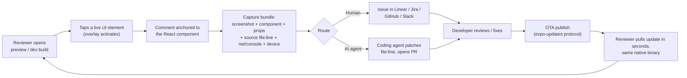
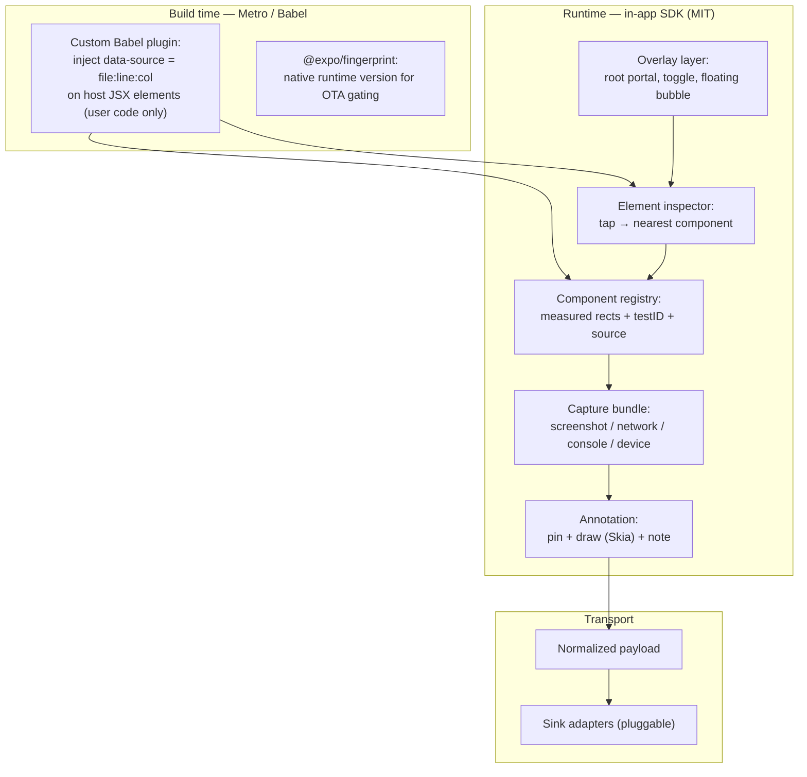
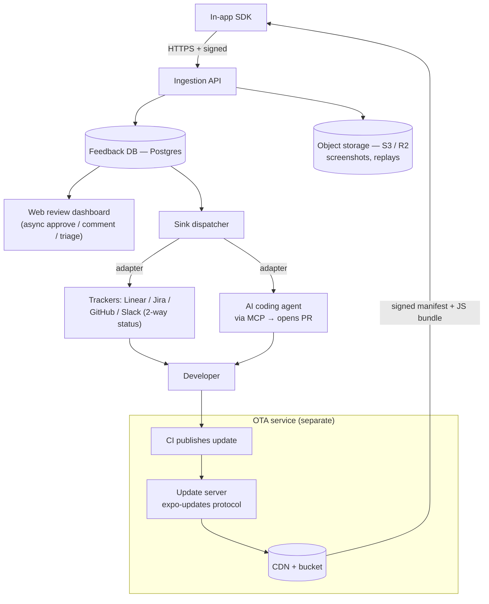
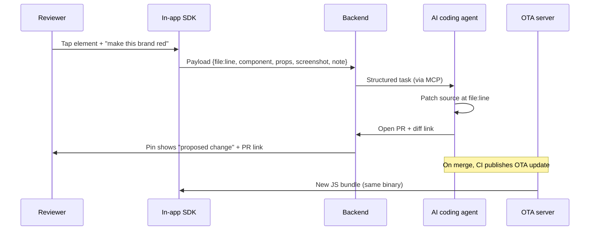

# In‑app iteration framework — technical research & architecture

*An open‑source, React Native–first framework that lets non‑technical people iterate, give feedback, and test **inside the running app** — where feedback anchors to a live UI component, and fixes ship back over‑the‑air in seconds.*

> **Working codename: `Loupe`** (a loupe is what you inspect fine detail with — rename freely). Used throughout for readability.

---

## TL;DR — the bet

1. **What the reference is.** The tweet you cited is from **Joe Ryan (Expo)**, whose thesis is: *"the new moat is being able to iterate on code in production."* The demo pattern is a loop — a non‑technical reviewer loads a **preview/OTA build**, gives **feedback in‑app**, the team **fixes and ships via OTA**, and the reviewer sees the change in seconds. That loop is what `Loupe` open‑sources.

2. **The gap worth owning.** Every shipping *native* mobile feedback tool (Instabug/Luciq, Shake, Bugsee, Gleap) binds a comment to an **(x,y) pixel on a frozen screenshot**. Web tools (BugHerd, Marker.io) bind to a **live element** via CSS selector — because the DOM is addressable. **Nobody does live‑element anchoring on native mobile.** React Native uniquely *can*, because you own the component tree in JS. **Anchoring a comment to a React component instance — not a bitmap — is the moat**, and it's exactly what makes the AI‑agent sink work (you can hand an agent the precise `file:line`).

3. **The architecture in one line.** A **build‑time Babel plugin** stamps a source‑location prop on every host element → a **runtime overlay** turns a tap into `{component, source file:line, props, geometry, screenshot, note}` → a **pluggable sink** routes that payload to **a human tracker** *or* **an AI coding agent that opens a PR** → the merged fix **ships OTA via the open `expo-updates` protocol**, which runs in **both managed Expo and bare RN** and is **self‑hostable**.

4. **Two hard constraints that shape everything.**
   - **Release builds strip source metadata** (Hermes + React 19 removed `_debugSource`). Full point‑and‑annotate runs in **dev / internal‑preview / instrumented** builds; production degrades gracefully to the human sink.
   - **OTA can only swap JS/assets/Hermes bytecode** against the **same native binary**. Native/dependency changes force a store build. Gate every update by a **native fingerprint** — the exact thing this repo (`expo-build-fingerprint-demo`) already demonstrates.

---

## 0. What the reference actually shows

The direct tweet 404s now, but the trail is unambiguous:

- **Joe Ryan is at Expo** and frames the shift as *"code is cheap now… the new competitive advantage is the ability to iterate on code in production — to keep improving and perfecting the end‑user experience."*
- Expo markets this directly: **["Quality is a function of iteration"](https://expo.dev/solutions/iteration-speed)** — *"Expo Updates remove the slowest parts of the mobile development cycle so teams can test changes faster, get feedback earlier… generate a preview update that anyone on their team can load on their device in seconds."*
- The New Stack: **["Expo bets big on React Native's agentic future"](https://thenewstack.io/expo-bets-big-on-react-natives-agentic-future/)** — the AI‑in‑the‑loop angle.

So the reference is a **feedback‑to‑iteration loop**: preview/OTA build → in‑app feedback → fast fix → OTA ship → seen in seconds, increasingly with an AI agent doing (or assisting) the fix. `Loupe` is the open‑source, backend‑agnostic version of that loop, with a real element‑anchoring capability the incumbents lack.

---

## 1. The core product loop



The whole value is **cycle time**: the reviewer never leaves the app, the developer/agent gets a precise, context‑rich task, and the fix returns without a store round‑trip.

---

## 2. The market gap and the moat

### 2.1 What everyone does today

| Category | Tools | In‑app on native RN? | How a comment is anchored |
|---|---|---|---|
| Native in‑app feedback SDKs | Instabug/**Luciq**, **Shake**, **Bugsee**, **Gleap**, Userback | ✅ real device SDK | **(x,y) on a frozen screenshot** |
| Observability + feedback | **Sentry** (User Feedback, Mobile Replay, Seer AI) | ✅ RN SDK, **MIT** | crash‑tied / standalone note; replay = masked snapshots |
| Web/DOM visual feedback | **BugHerd**, **Marker.io**, Ruttl, **Jam.dev** | ❌ DOM only (Jam adding RN logging) | **live element via CSS selector/XPath** |
| Usability research | UserTesting, Maze | ⚠️ records participants | n/a (different job) |
| Storybook on‑device | `@storybook/react-native`, Sherlo, Chromatic | ✅ on‑device, **MIT** | n/a (per‑story review) |

**The load‑bearing observation:** native SDKs have no queryable element tree, so they *all* degrade to coordinate‑on‑bitmap. Some (Luciq, Sentry) separately dump a **view hierarchy** for developers, but they never use it to *bind a comment* to a component.

### 2.2 Why React Native changes the game

Unlike Swift/Kotlin UI, in RN **you own the component tree in JavaScript**. You can:
- wrap the app root and maintain a **registry of mounted components** with measured on‑screen rects (`measureInWindow`),
- read each element's **`testID` / `accessibilityLabel`**,
- in instrumented builds, read a **source `file:line`** you injected at build time,
- hit‑test a tap to the **nearest component instance**.

So a `Loupe` pin binds to *"the `PriceTag` in `ProductRow`, defined at `app/screens/Cart.tsx:42`"* — not *"pixel (218, 640) on a screenshot."* That is:
- **more durable** (survives layout changes/re‑renders),
- **directly actionable for a human** (deep‑link straight to the source), and
- **the unlock for the AI sink** (hand the agent an exact file/line + props + intent).

**This is the one thing to be genuinely better at than every incumbent.** Everything else in the stack is assembly of existing open‑source parts.

---

## 3. Mobile architecture — the client SDK

Three layers: **build‑time instrumentation**, **runtime capture**, **transport**. All runtime code is plain RN + MIT primitives (no proprietary native core), so it works in **Expo dev/preview builds** and **bare RN** alike.



### 3.1 Build‑time layer — inject your own source location (do **not** rely on React internals)

The classic "click‑to‑source" trick read React's `fiber._debugSource`, populated from Babel's `__source` JSX metadata. **That is being deleted:**

- **React 19 removed `_debugSource` from fibers** ([facebook/react #28265](https://github.com/facebook/react/pull/28265); devs asking for it back in [#31981](https://github.com/facebook/react/issues/31981), [#32574](https://github.com/facebook/react/issues/32574)).
- **React 19.2 removed the `source`/`self` args from `jsxDEV`**, and Babel 8 stops passing them ([babel #17571](https://github.com/babel/babel/issues/17571)).

**Solution:** ship a tiny **custom Babel plugin** that injects a *real, load‑bearing prop* onto each host JSX element — e.g. `data-source="app/screens/Cart.tsx:42:6"` — restricted to user code (skip `node_modules`). Because it's an ordinary prop it lands in `fiber.memoizedProps` and is readable at runtime with **zero React‑internal dependency**, and it **survives Hermes** (it's just a prop). `env`‑gate it in `babel.config.js` so it's stripped from true production but *keepable* in a dedicated "feedback" build variant.

Proven precedents to copy: **Onlook's `data-oid`** (open source, `onlook-dev/onlook`) and **`react-native-dev-inspector`'s `__callerSource`** (open source — read this repo; it's a working reference).

### 3.2 Runtime layer — tap → component → payload

- **Invocation:** mirror RN's **Dev Menu / `expo-dev-menu`** shake trigger (already shake/3‑finger invoked; extend via `registerDevMenuItems`) plus a **floating bubble** fallback for non‑debug builds (`react-native-shake` is MIT, New‑Arch ready).
- **Element hit‑test (dev):** RN's built‑in inspector primitive **`getInspectorDataForViewAtPoint(rootRef, pageX, pageY, cb)`** (path moved to `react-native/src/private/inspector/…` in recent RN) walks the fiber tree → component hierarchy + source. Enrich/replace its source with your injected `data-source` prop so you don't depend on React internals.
- **Anchoring (dev + release):** maintain a **component registry** keyed by a stable id; measure each candidate with **`ref.measureInWindow()`** (New Arch — avoid `findNodeHandle`, discouraged on Fabric). Set **`collapsable={false}`** on wrapped views or layout‑only nodes vanish from the native tree and can't be measured.
- **Overlay:** a full‑screen absolutely‑positioned root sibling (`Modal` / `@gorhom/portal` / `react-native-root-siblings`), `pointerEvents` toggled `none` ↔ `box-only` so it's inert until inspect mode. Highlight box drawn from the measured rect. This is exactly the **Storybook on‑device** overlay pattern (MIT reference).
- **Annotation:** draw/markup with **`@shopify/react-native-skia`**, draggable pins with **gesture-handler + reanimated**, re‑flatten with **`react-native-view-shot`** (Expo's recommended screenshot lib).
- **Context capture (the "bundle"):** match what the commercial SDKs ship, from MIT parts:
  - screenshot → `react-native-view-shot`
  - network → `react-native-network-logger` (wraps RN's `XHRInterceptor`, zero native deps → Expo‑Go‑safe)
  - console/JS errors → monkey‑patch `console.*` + `ErrorUtils.setGlobalHandler`
  - navigation/touch breadcrumbs
  - device/app → `expo-device` / `expo-constants`
  - **the current OTA update id / channel** → `expo-updates` (`Updates.updateId`, `Updates.channel`) so every report is tied to the exact bundle it came from.

### 3.3 The dev‑vs‑release capability wall (design around this)

| Capability | Expo Go / dev | Preview / dev‑client | Release (store) |
|---|---|---|---|
| Screenshot, network, console, device | ✅ | ✅ | ✅ |
| Measured‑rect anchoring (`measureInWindow`) | ✅ | ✅ | ✅ |
| `testID` / `accessibilityLabel` anchoring | ✅ | ✅ | ✅ |
| Component name + props | ✅ | ✅ | ⚠️ names may be minified |
| **Source `file:line`** (injected `data-source`) | ✅ | ✅ *(if plugin kept)* | ⚠️ only in an **instrumented variant** |
| `getInspectorDataForViewAtPoint` | ✅ | ✅ | ❌ DevTools hook absent |
| **Route to AI agent with exact file:line** | ✅ | ✅ | ❌ → **degrade to human sink** |

**Consequence:** `Loupe`'s full power targets **dev / internal‑preview / TestFlight‑style / instrumented** builds — precisely where non‑technical reviewers actually test. In pure production, it degrades to the incumbent model (screenshot + component + props + coordinates → human tracker), which is still useful.

---

## 4. Backend architecture

Keep it small, self‑hostable, and split into two independent services: **Feedback** and **OTA** (they have different scaling and security profiles).



**Feedback service**
- **Ingestion API** — thin authenticated endpoint; accepts the normalized payload + pre‑signed uploads for screenshots/replays.
- **Storage** — Postgres for feedback/threads/status; object storage (S3 / Cloudflare R2) for binaries.
- **Web review dashboard** — the *non‑technical async surface*: a Kanban/list where PMs, designers, and clients review, approve, comment, and see status — the **Sherlo/Chromatic + BugHerd** pattern. In‑app threads (Instabug/Gleap pattern) mirror status back onto the pin.
- **Sink dispatcher** — adapter interface over the normalized payload (see §6).

**Suggested stack (all self‑hostable):** Node/TypeScript API (Fastify/Nest) or Go; Postgres; S3/R2; dashboard in Next.js/Expo Router web; deploy on Fly.io/Render/your own K8s. Nothing here is exotic — the novelty is entirely client‑side anchoring.

---

## 5. OTA update strategy

### 5.1 The decision

**Standardize on the open `expo-updates` protocol.** It is the only option that is simultaneously:
- an **open, published spec** ([Expo Updates protocol v1](https://github.com/expo/expo/blob/main/docs/pages/technical-specs/expo-updates-1.mdx)),
- runnable in **both managed Expo and bare React Native** (the `expo-updates` library is not Expo‑workflow‑locked),
- shipped with **fingerprint‑based native‑compatibility gating** and **manifest code signing** built in, and
- backed by **both** a hosted service (EAS Update) **and** a production‑grade **self‑hostable server** (`expo-open-ota`).

Ship `expo-updates` in the framework; let users point `updates.url` at **EAS** *or* **their own `expo-open-ota`** deployment. "Works with and without Expo, hosted or self‑hosted" falls out of a single integration.

### 5.2 How the safety works (and why this repo matters)

An update only reaches a binary whose **runtime version** matches. The recommended policy is **`fingerprint`**: **`@expo/fingerprint`** hashes the native dependency graph + config; add a native module and the fingerprint (hence runtime version) changes, so the server refuses to send new JS to incompatible binaries. **This is the anti‑bricking mechanism, and it's exactly what `expo-build-fingerprint-demo` already exercises** — the fingerprint you're computing for build caching is the same signal that gates OTA safety.

### 5.3 Options compared

| Solution | Expo | Bare RN | Open‑source | Self‑hostable | Native‑safety | Status (2026) |
|---|---|---|---|---|---|---|
| **`expo-updates` + EAS** | ✅ | ✅ | client OSS; backend proprietary | via open protocol | **strong** (fingerprint) | mature, Expo‑maintained |
| **`expo-open-ota`** (self‑host the protocol) | ✅ | ✅ | **MIT** | **✅** | strong (inherits protocol) | prod since early 2025, >1M MAU |
| **`hot-updater`** | ✅ | ✅ | **MIT** | **✅** | manual gating | active; bsdiff Hermes patching |
| **RevoPush** (CodePush fork) | ✅ | ✅ | client OSS | server partial | manual | drop‑in CodePush successor |
| **Bitrise CodePush** | ✅ | ✅ | SDK fork OSS; server proprietary | ❌ | rings | GA ~Mar 2026, vendor‑hosted |
| Microsoft CodePush | — | — | archived | — | — | **dead (Mar 31 2025)** |
| Shorebird | Flutter only | Flutter only | mostly OSS | ❌ | n/a | reference only |

- **Primary + self‑host reference:** `expo-updates` protocol, with **`expo-open-ota`** (MIT, S3 + CDN, rollouts, rollback, signing) as the documented self‑hosted path.
- **Alternative "classic CodePush" track:** **`hot-updater`** (MIT, self‑hostable) or **RevoPush** as a secondary adapter for teams migrating off App Center. *(Microsoft archived `react-native-code-push` on May 20, 2025 — no official successor; the community forked it.)*
- **Managed convenience adapters (optional):** EAS Update, **Bitrise CodePush**, Cresc — thin backend adapters, not embeddable OSS. *(Bitrise CodePush is relevant to you as a managed backend, but it's proprietary/hosted, so it's an adapter, not the OSS core.)*

### 5.4 Store‑policy invariants to bake in (not leave to convention)

- **Apple:** DPLA **§3.3.2** explicitly permits downloaded **interpreted code** if it doesn't change the app's **primary purpose** and runs in the shipped JS engine (this governs over Guideline 2.5.2). **Native code OTA is banned.**
- **Google Play:** Device & Network Abuse policy carves out **interpreted code run in a VM/interpreter**; downloading dex/JAR/.so is banned.
- **Structural guarantee:** JS/Hermes‑bytecode‑only payloads; **fingerprint/runtime‑version gate on every publish**; manifest **code signing** + TLS + per‑asset SHA‑256; **staged rollout** + **crash‑gated auto‑rollback** to last‑known‑good/embedded bundle; a hard rule that **native/dependency changes force a store build.**

---

## 6. The pluggable sink — human **or** AI (switchable per pin)

The capture pipeline is shared; the **destination is an adapter** over one normalized payload:

```jsonc
{
  "source":    { "file": "app/screens/Cart.tsx", "line": 42, "column": 6 }, // dev/instrumented only
  "component": { "name": "PriceTag", "ownerStack": ["Cart", "ProductRow", "PriceTag"] },
  "props":     { "testID": "price-tag", "...": "memoizedProps" },
  "geometry":  { "x": 0, "y": 0, "width": 0, "height": 0 },  // measureInWindow
  "screenshot":"<url>",
  "note":      "make this bold and use brand red",
  "context":   { "updateId": "...", "channel": "staging", "device": {}, "network": [], "console": [] },
  "route":     "human"   // | "agent"
}
```

**Human‑tracker adapters** (ship first): Linear, Jira, GitHub Issues, Slack, + generic webhook. Match **Marker.io's 2‑way status sync** (tracker status reflected back on the in‑app pin). For humans, attach a **deep link that opens `file:line` in the editor** (reuse Metro's `/__inspect-open-in-editor` → `launch-editor`).

**AI‑agent adapter** (the novel sink):



- The clearest shipping precedent is **Sentry Seer** (2025): structured error context → AI root cause → **opens a GitHub PR**. Generalize it: your payload (**exact file:line** + intent + props + screenshot) is *ideal* coding‑agent input — and the **component‑source anchoring is what lets you give the agent the precise file to change**, which none of the screenshot‑markup tools can.
- **Transport:** expose feedback as an **MCP server** (resources/tools) so Claude Code / Cursor / Codex‑style agents pull full context and propose a diff (`metro-mcp` shows the pattern for RN/Metro over MCP); or a direct "open PR" job. Post the PR link back onto the in‑app thread.
- **Switchable:** the same pin can be *"ask a human"* or *"ask the agent,"* per annotation.

---

## 7. Recommended tech stack (concrete)

**Client SDK (`@loupe/react-native`, MIT)**

| Concern | Package / API |
|---|---|
| Source injection | custom Babel plugin (model on Onlook `data-oid` / dev‑inspector `__callerSource`) |
| Invocation | `expo-dev-menu` (`registerDevMenuItems`) + `react-native-shake` + floating bubble |
| Element hit‑test (dev) | `getInspectorDataForViewAtPoint` |
| Measurement/anchoring | `ref.measureInWindow()`, `onLayout`, `collapsable={false}` |
| Overlay | `Modal` / `@gorhom/portal` / `react-native-root-siblings` |
| Annotation | `@shopify/react-native-skia`, `react-native-gesture-handler`, `react-native-reanimated` |
| Screenshot | `react-native-view-shot` |
| Network / console | `react-native-network-logger` (`XHRInterceptor`), `console.*` + `ErrorUtils` |
| Device / build context | `expo-device`, `expo-constants`, `expo-updates` |

**Backend (`@loupe/server`, MIT SDK / optional FSL backend)**
- API: TypeScript (Fastify/Nest) or Go · DB: Postgres · Objects: S3/R2 · Dashboard: Next.js / Expo Router web · Sink adapters: Linear/Jira/GitHub/Slack/webhook + **MCP** AI adapter.

**OTA**
- `expo-updates` (client) → **EAS** *or* **`expo-open-ota`** (self‑host) · gating via **`@expo/fingerprint`** · signing + staged rollout + crash‑gated rollback. Secondary adapter: `hot-updater` / RevoPush.

**Licensing:** **MIT** for the SDK (like Sentry's SDKs and Storybook — actually adoptable); optional **FSL→Apache‑2.0** for any hosted backend (Sentry's model) if you want to prevent SaaS resale while keeping self‑host open.

---

## 8. Build vs. buy — what to reuse, what's novel

**Reuse (don't rebuild):** OTA (`expo-updates`/`expo-open-ota`), screenshot/network/console capture, overlay/portal, Skia annotation, shake invocation, `@expo/fingerprint`, MCP transport, Sentry SDKs if you want crash/replay. All MIT/open.

**The novel ~20% that is the whole point:**
1. The **Babel source‑injection plugin** (React‑19‑proof).
2. The **component registry + tap‑to‑component anchoring** engine (the moat).
3. The **normalized payload + pluggable sink** (human ↔ AI), with the **AI/MCP "open a PR from a pin" adapter**.
4. The **non‑technical review dashboard** tying pins ↔ tracker ↔ PR ↔ OTA channel.

There is **no mature open‑source, self‑hostable "in‑app annotated feedback for RN"** today (Sentry is the only self‑hostable option in the landscape, and it's observability‑first). That's the open lane.

---

## 9. Phased roadmap

- **Phase 0 — Thin vertical slice (proof).** Babel plugin injects `data-source`; overlay + shake toggle; tap → `{component, file:line, screenshot, note}`; one sink: open a GitHub issue with an editor deep‑link. Runs in an Expo dev build. *Proves the anchoring is real.*
- **Phase 1 — Capture bundle + trackers.** Add network/console/device context, pin persistence, and Linear/Jira/Slack adapters with 2‑way status. Add the web review dashboard.
- **Phase 2 — OTA loop.** Wire `expo-updates` + `expo-open-ota`; fingerprint gating; show "fixed in build X" back on the pin. Now the full loop closes in seconds.
- **Phase 3 — AI sink.** MCP server exposing pins; "route to agent" opens a PR from `{file:line + intent + props + screenshot}`; surface the diff on the pin. Add bare‑RN support + an instrumented release variant.
- **Phase 4 — Polish.** Session replay (Sentry‑style masked snapshots), privacy redaction, self‑host docs, and managed‑backend adapters (EAS / Bitrise CodePush / hot‑updater).

---

## 10. Risks & open questions

- **React internals churn** — mitigated by injecting your **own** prop; never read `_debugSource`/`jsxDEV` source.
- **Release‑build wall** — full anchoring needs dev/instrumented builds; be explicit that production degrades to the human sink. Decide whether to ship a **dedicated instrumented "feedback" variant** for stakeholders (keeps `file:line` in a non‑dev binary).
- **New Architecture (Fabric)** — pass **refs**, not `findNodeHandle`; `measureLayout` is deprecated on Fabric ([#46570](https://github.com/facebook/react-native/issues/46570)). Verify the private inspector import path per RN version.
- **Privacy** — copy **Sentry's default‑mask‑all‑text/images** for any replay/screenshot in shared builds.
- **AI‑sink trust** — agent output is a **PR/proposed diff behind review**, never an auto‑merge; the OTA rollback path is the safety net.
- **Maintenance flags to confirm before citing externally** (as of research date): Instabug→**Luciq** rebrand (repo archived ~Jan 28 2026); exact pricing for Luciq/Bugsee/Marker.io/Jam/Chromatic/Sherlo; Marker.io's **RN SDK** (reported building, May 2026); `@storybook/react-native` v9 status; `sentry-expo` deprecation into `@sentry/react-native` v5+.

---

## Appendix — key sources

**Reference / framing**
- Expo, *Quality is a function of iteration* — https://expo.dev/solutions/iteration-speed
- The New Stack, *Expo bets big on React Native's agentic future* — https://thenewstack.io/expo-bets-big-on-react-natives-agentic-future/

**Element inspection / comment‑to‑code**
- `react-native-dev-inspector` — https://github.com/VaheSaroyan/react-native-dev-inspector
- Radon IDE (element inspector → jump to source) — https://radon.swmansion.com/docs/features/element-inspector
- Onlook (`data-oid` build‑time mapping, OSS) — https://github.com/onlook-dev/onlook
- React 19 removed `_debugSource` — https://github.com/facebook/react/pull/28265 · https://github.com/facebook/react/issues/32574
- `jsxDEV` source/self removed (Babel 8) — https://github.com/babel/babel/issues/17571
- Fabric `measureLayout` deprecation — https://github.com/facebook/react-native/issues/46570
- `metro-mcp` (RN/Metro over MCP) — https://metromcp.dev/tools.html

**Feedback SDK landscape**
- Instabug/Luciq RN SDK — https://github.com/Instabug/Instabug-React-Native
- Shake RN SDK — `@shakebugs/react-native`
- Sentry RN (MIT) + User Feedback + Mobile Replay + Seer — https://github.com/getsentry/sentry-react-native
- BugHerd (element‑anchored web feedback) — https://bugherd.com/visual-feedback-tool
- Marker.io — https://marker.io · Jam.dev — https://jam.dev
- Storybook on‑device (MIT) — `@storybook/react-native`, Sherlo, Chromatic

**OTA**
- Expo Updates: how it works — https://docs.expo.dev/eas-update/how-it-works/ · runtime versions/fingerprint — https://docs.expo.dev/eas-update/runtime-versions/ · protocol v1 — https://github.com/expo/expo/blob/main/docs/pages/technical-specs/expo-updates-1.mdx
- `expo-open-ota` (self‑host, MIT) — https://github.com/axelmarciano/expo-open-ota
- `hot-updater` (MIT) — https://github.com/gronxb/hot-updater · RevoPush — https://github.com/revopush/react-native-code-push
- Microsoft CodePush archived — https://github.com/microsoft/react-native-code-push
- Bitrise CodePush — https://bitrise.io/platform/codepush
- Store policy (Apple 3.3.2 / 2.5.2, Google Play) — https://developer.apple.com/app-store/review/guidelines/ · https://support.google.com/googleplay/android-developer/answer/16559646

*Reusable OSS primitives (screenshot, network, overlay, shake, annotation) verified as MIT and New‑Architecture‑compatible; time‑sensitive commercial facts (pricing, rebrands) flagged above for confirmation before external citation.*
