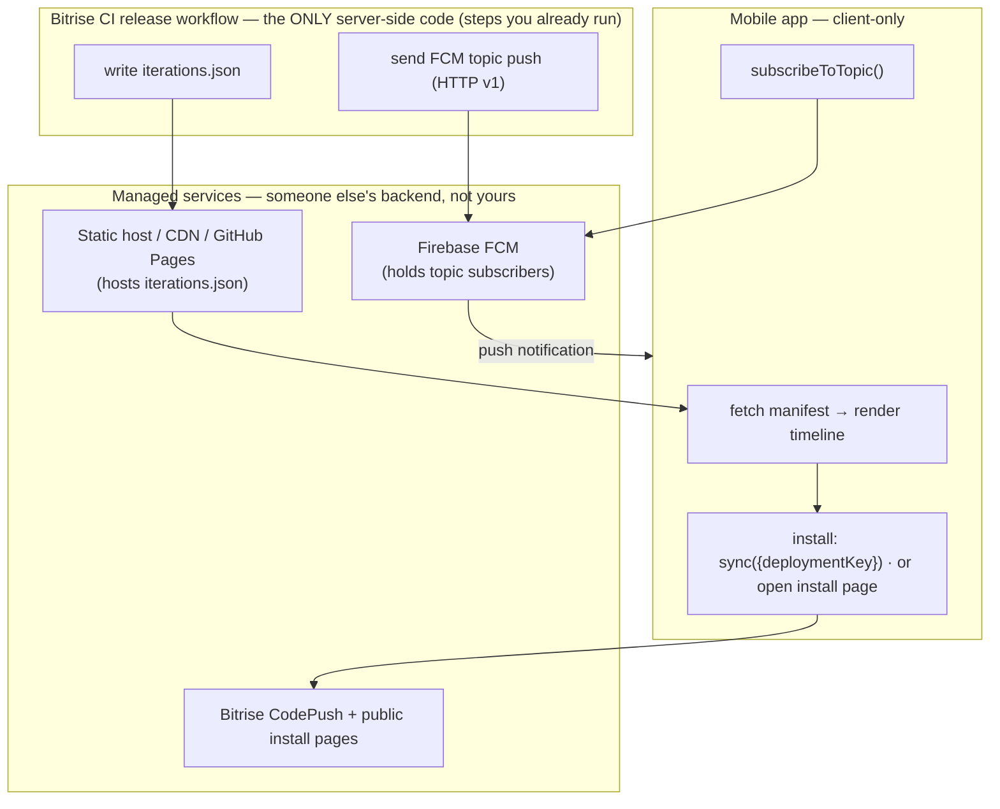

# In-app iterations list + new-version notifications — the no-backend design

*Concrete designs for feature #2 (an in-app timeline of iterations you can install any of) and #4 (notify testers when a new iteration is ready), and the answer to the load-bearing question: **do they need a backend?***

> Companion to the [Bitrise-native architecture](./bitrise-codepush-rde-architecture.md) (§3.3–3.4 sketch these; this doc makes them concrete and verified against current 2026 docs).

---

## The answer, up front

**Neither feature needs a custom backend or database for an early-stage / prototyping team.** The only server-side code involved is a few steps inside the **Bitrise CI release workflow you already run** — no standing service, no DB, no Expo cloud.

| Feature | Backend needed? | Minimal footprint | You need a backend **only** when… |
|---|---|---|---|
| **#2** — iterations list + install-any | **No** | CI writes a static `iterations.json` to a public URL → app fetches it → installs each iteration **client-side** (`codePush.sync({deploymentKey})` for OTA; open the Bitrise public install-page URL for native) | live metrics/"who's on what" · per-user targeting · private/authenticated distribution · stateful/fresh-on-demand data |
| **#4** — new-version notifications | **No** | Devices `subscribeToTopic()` **client-side** (RN Firebase) → the CI release step sends to that FCM topic via **HTTP v1** (service-account in Bitrise Secrets) → **FCM bridges APNs** for iOS | per-user/targeted sends · delivery/open analytics · in-app inbox/history · server-side preferences |

**Why "no backend" holds:** the only party that touches a secret is your **CI** (it holds the Bitrise PAT and the Firebase service account, and it *publishes* — writes the manifest, sends the push). The **app only ever reads public/non-secret things**: a static JSON file, *non-secret* CodePush deployment keys, public install pages, and an FCM topic. And the push **subscriber registry is held by Google/Firebase, not you** — so there's no device-token database to run.



---

## #2 — In-app iterations list + install any iteration

### The constraint that shapes the design
A CodePush deployment only ever serves its **latest enabled release** for the running binary version — the client **cannot request an arbitrary older label**, and there is **no client API to list release history** (that's token-gated server data). The client *can* read the **currently running** update (`getUpdateMetadata(RUNNING)` → `label`, `deploymentKey`, `appVersion`, `description`) to show which iteration is active.

**Therefore "install any iteration" = one deployment per shareable iteration**, and the app switches between them with the runtime **`codePush.sync({ deploymentKey })`** override. Deployment keys are **not secrets** (Bitrise ships them as plain strings in the binary), so the app may legitimately hold/fetch many and pick one. (A single rotating "preview" deployment is lighter but only gives one global selection, not per-user choice.)

### Where the list comes from (the tokenless data source)
The Bitrise APIs that could list updates/builds/metrics require a **workspace-scoped Personal Access Token** — which must **never** ship in a distributed app (it grants workspace access and is as extractable as the deployment keys). So the CI job (which already holds the token) **publishes a static manifest** instead:

```jsonc
// iterations.json — written by the CI release workflow, hosted at a public URL
{
  "app": "bitrise-demo",
  "updatedAt": "2026-08-04T12:00:00Z",
  "iterations": [
    { "label": "v42", "type": "ota", "deploymentKey": "<non-secret key>",
      "appVersion": "1.0.0", "description": "Fix cart button color",
      "createdAt": "2026-08-04T11:59:00Z" },
    { "label": "build-318", "type": "native", "appVersion": "1.1.0",
      "installUrl": "https://app.bitrise.io/artifact/.../public-install-page",
      "description": "Add camera module", "createdAt": "2026-08-03T09:00:00Z" }
  ]
}
```
- **Host the manifest** on a stable public URL: an S3/R2/GCS bucket, **GitHub Pages / `raw.githubusercontent.com`**, or Netlify/Vercel static. (Bitrise's own artifact URLs are per-build and random — great for the *native install links inside* the manifest, not for the manifest's own stable URL.)
- The CI step appends an entry when it releases: OTA rows carry the `deploymentKey`; native rows carry the build's `BITRISE_PUBLIC_INSTALL_PAGE_URL`.

### Installing on-device — client-side, no backend
- **OTA / JS:** `codePush.sync({ deploymentKey: <from manifest>, installMode: codePush.InstallMode.IMMEDIATE })`. The SDK talks to Bitrise's CodePush server directly with the non-secret key. That's the whole install.
- **Native build:** open the **public install page** URL (permanent, no-login). **Android:** APK sideload (user enables unknown sources). **iOS:** goes through Apple's `itms-services` flow — **the device UDID must already be in the ad-hoc/enterprise provisioning profile**, and the link **must open in native Safari** (in-app browsers are blocked), so you hand off to Safari rather than install silently.

### When #2 needs a backend (or a thin proxy)
Live metrics/"who's on what" · per-user or server-decided targeting · authenticated/private distribution (access codes, expiring links, tester login) · fresh-on-demand or write-back (favorites, audit). The first upgrade step is a **thin serverless proxy** (Cloudflare Worker / Vercel function) holding the PAT — still not a full backend.

---

## #4 — Notify testers a new iteration is ready

### Sender: your CI, not a server
- **FCM's legacy "server key" API was shut down (July 22, 2024).** You must use **HTTP v1** with a short-lived **OAuth2 token minted from a service-account JSON** (scope `https://www.googleapis.com/auth/firebase.messaging`).
- **Topics = broadcast with no token store.** Devices subscribe client-side; **Firebase holds the subscriber list**. To notify, POST one message with a `topic` target — Firebase fans out. **iOS is covered by the same send** once you upload your **APNs `.p8` key** to Firebase (FCM bridges to APNs; you never call APNs yourself).
- The **final step of the release workflow** is the sender (secrets live in **Bitrise Secrets**, marked protected):

```bash
# Bitrise release workflow — final step, after a successful codepush push / deploy
printf '%s' "$FIREBASE_SA_JSON" > /tmp/sa.json           # from Bitrise Secrets (protected)
export GOOGLE_APPLICATION_CREDENTIALS=/tmp/sa.json
TOKEN="$(gcloud auth application-default print-access-token \
          --scopes=https://www.googleapis.com/auth/firebase.messaging)"   # or oauth2l / google-auth-library
curl -fsS -X POST "https://fcm.googleapis.com/v1/projects/${FCM_PROJECT_ID}/messages:send" \
  -H "Authorization: Bearer ${TOKEN}" -H 'content-type: application/json' -d "{
    \"message\": { \"topic\": \"iterations-${CODEPUSH_DEPLOYMENT}\",
      \"notification\": { \"title\": \"New iteration ready\",
                          \"body\": \"Tap to install ${APP_VERSION}\" } } }"
```
*(If `gcloud` isn't on your stack, mint the token with `oauth2l` or a 5-line `google-auth-library` script — same result.)*

### Client: RN Firebase, no Expo cloud
- `@react-native-firebase/messaging`: `messaging().subscribeToTopic('iterations-staging')` registers with FCM **directly — no server of yours, no token to persist**. Add permission request + `onMessage` / `setBackgroundMessageHandler`.
- Expo prebuild wiring: `@react-native-firebase/app` + `@react-native-firebase/messaging` plugins, `google-services.json` / `GoogleService-Info.plist`, `expo-build-properties` `ios.useFrameworks: "static"`, APNs entitlement. Native module → dev/custom build (already true for your stack; Expo Go won't run it).
- **Avoiding Expo lock-in:** `expo-notifications`' convenient remote push routes through Expo's service; going **direct FCM/APNs via RN Firebase avoids it** (and its topics avoid the token-list approach entirely). If you ever use `expo-notifications`, `getDevicePushTokenAsync()` returns the raw FCM/APNs token so you can still send yourself — but for broadcast, RN Firebase topics are strictly simpler.

### Trigger
There is **no Bitrise CodePush "release published" webhook** (outgoing webhooks fire on **build events only**), so the push is emitted by the release workflow's final step (above), after the OTA `codepush push` or the native `deploy-to-bitrise-io`. Free complementary channel for **native** builds: Bitrise **tester-group emails** ("send notifications automatically") — zero code, but email-only and native-only.

### Caveats
- Topic delivery is **best-effort / not low-latency** (fine for "a build is ready," not for time-critical pings). Include a visible `notification` payload so iOS displays it when backgrounded.
- Service account needs a messaging role (a role-less SA 403s); mint the token **in the step** (~1 h TTL), don't cache across builds.

### Managed alternatives (their backend, still no Expo lock-in)
| Option | No-backend broadcast? | Your token DB? | Notes |
|---|---|---|---|
| **FCM topics** *(recommended)* | ✅ | ❌ | Reuses the delivery layer you already need; sender is a stateless CI step |
| **OneSignal** | ✅ | ❌ (they store) | Fastest dashboard/segments/analytics; adds a vendor + SDK; official Expo plugin |
| **Pusher Beams** | ✅ | ❌ (they store) | Topic-equivalent "device interests"; **confirm current product status before adopting** |
| **Expo Push** | ⚠️ | ✅ you store tokens | No topics → token-list fan-out → nudges you toward a backend; and it's the Expo cloud you're avoiding |

### When #4 needs a backend
Per-user/targeted notifications · delivery receipts / open & install analytics · in-app notification inbox/history · server-managed unsubscribe & preferences · triggering on non-build events. Until then: **client-side topic subscribe + a CI send step + Firebase (APNs bridged) = no device-token DB, no standing server.**

---

## The shared graduation line

Both features follow the same stage philosophy as the [security model](./feedback-agent-security.md#0--start-here-right-size-to-your-stage): **start backendless; add a thin serverless proxy (then a full backend) only when you cross a specific line** — chiefly **per-user targeting**, **live metrics/analytics**, or **private/authenticated access**. For a founding team shipping to a handful of testers, none of those apply yet, so:

- **#2:** CI writes `iterations.json` (public) + client-side install. **No backend.**
- **#4:** client `subscribeToTopic` + CI sends via FCM HTTP v1 (APNs bridged). **No backend.**

---

## Sources
- CodePush client (latest-only, `deploymentKey` override, `getUpdateMetadata`, keys not secret): [react-native-code-push JS API](https://github.com/microsoft/react-native-code-push/blob/master/docs/api-js.md) · [Bitrise: configuring your app](https://docs.bitrise.io/en/release-management/codepush/configuring-your-app-for-codepush)
- Bitrise API auth (PAT/workspace token): [Release Management API](https://docs.bitrise.io/en/release-management/release-management-api) · [Personal access tokens](https://docs.bitrise.io/en/bitrise-platform/accounts/personal-access-tokens.html)
- Public install page (permanent no-login; iOS Safari + UDID; Android APK): [Distributing builds to testers](https://docs.bitrise.io/en/release-management/build-distribution/distributing-builds-to-testers) · [Installing an IPA from the public install page](https://docs.bitrise.io/en/bitrise-ci/deploying/ios-deployment/installing-an-ipa-file-from-the-public-install-page)
- FCM: [legacy → HTTP v1 migration](https://firebase.google.com/docs/cloud-messaging/migrate-v1) · [send v1 / topics](https://firebase.google.com/docs/cloud-messaging/send/v1-api) · [topic messaging](https://firebase.google.com/docs/cloud-messaging/android/topic-messaging) · [auth (scope/token)](https://firebase.google.com/docs/cloud-messaging/auth-server) · [Apple/APNs `.p8`](https://firebase.google.com/docs/cloud-messaging/ios/certs) · [delivery caveats](https://firebase.google.com/docs/cloud-messaging/understand-delivery)
- Client: [`@react-native-firebase/messaging`](https://www.npmjs.com/package/@react-native-firebase/messaging) · [rnfirebase.io](https://rnfirebase.io/) · Expo lock-in: [Expo push FAQ](https://docs.expo.dev/push-notifications/faq/) · [third-party push services](https://docs.expo.dev/guides/using-push-notifications-services/)
- Bitrise triggers: [outgoing webhooks (build events only)](https://docs.bitrise.io/en/bitrise-platform/integrations/webhooks/adding-outgoing-webhooks.html) · [tester groups](https://docs.bitrise.io/en/release-management/build-distribution/tester-groups)

*Verified Aug 2026. One item unconfirmed: current product status of Pusher Beams — confirm before adopting.*
