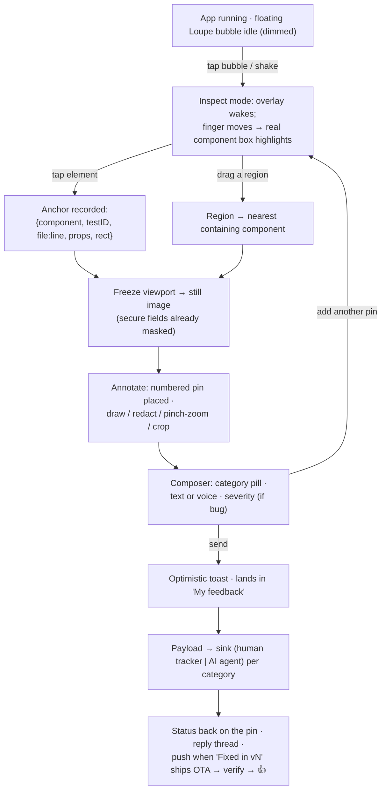

# Screenshot + comment-on-a-part — capture design (UX + technical)

*The heart of the framework: how a non-technical person takes a screenshot and says which part they want changed, right inside the app. It should feel like **commenting on a photo**, never like inspecting code. Verified against this repo's stack — **Expo SDK 54, RN 0.81, React 19.1, Hermes, New Architecture (Fabric)**.*

> Companion to the [framework doc](./in-app-iteration-framework.md) (§3.2) and the [Bitrise architecture](./bitrise-codepush-rde-architecture.md). Notation used throughout: **[DEV]** = works in a debug/dev-client/preview build; **[REL]** = survives into a store/Hermes release. That split is the whole game for the "which component" precision.

---

## The one move that makes this work: "pick live, then freeze"

The obvious options each have a fatal flaw. *Screenshot-then-annotate* (every mobile SDK) binds a comment to a **pixel on a dead bitmap** — no component, no `file:line`, useless to an AI sink. *Live annotation* gives you the component but you're drawing on a **moving target** (video loops, keyboard, animations, ads).

**Loupe does both, in order:** the reviewer **taps the live UI** → the real component's box highlights and the durable anchor is recorded `{component, testID, file:line, props, measured rect}` → Loupe **instantly freezes that view to a still image**, and all annotation/redaction/zoom/commenting happens on the stable frame. You get live-element semantics *and* a stable canvas. In a pure production build with no queryable tree, step one silently degrades to "freeze first, pin is a coordinate" — **same UI, less metadata, reviewer never notices.**



---

# Part A — UX spec

## A1. Invocation: a visible bubble, not a hidden gesture

| Trigger | Default | Role |
|---|---|---|
| **Floating bubble** (draggable, edge-docking, fades to ~30% when idle) | **ON** | **Primary.** Always discoverable; non-technical reviewers can't use an invisible gesture. |
| **Shake** (debounced ~600 ms) | ON Android / **OFF iOS** | Accelerator only. Off on iOS — it collides with Shake-to-Undo, and a gesture must never be the *only* trigger (Apple HIG). |
| **Screenshot-taken** hook | Optional | Catches the instinct to screenshot. (Apple has rejected apps for hooking this — keep opt-in.) |
| **Menu item / deep link** | Always | The accessibility-equivalent path (VoiceOver-navigable). |

**Discoverability:** one first-run **coach mark** on the bubble ("Tap here to give feedback"), dismissible, re-openable from Help. Teach exactly one thing (NN/g).

## A2. Marking "which part"

| Mechanism | Best when | Anchor quality | Verdict |
|---|---|---|---|
| **Tap an element (auto-highlight the box)** | pointing at any real UI piece | **component + file:line** | **Primary** |
| **Drag a region** (rubber-band) | "this whole area" / between elements / production builds | region → containing component | **Fallback #1** |
| Tap a point pin (+ magnifier loupe on touch-down) | one exact spot | coordinate (+ nearest component) | Fallback #2 |
| Freehand / arrow / shapes | emphasis only ("circle this") | **none — decoration** | Optional, **never required** (accessibility) |

Auto-highlight is self-correcting — the reviewer *sees the box before committing*, so they know they pinned the right thing. It's also the only mechanism that yields `file:line` for the human/AI sink.

## A3. The unit of feedback is the **pin**, not the screenshot

One pin = one anchored part + one comment + one category. Many pins per capture, each **independently routable and resolvable** (the Figma/BugHerd model), not one blob comment for the whole report (the SDK model). Pins are numbered badges (1, 2, 3…), cluster at low zoom, and mirror into a bottom **thumbnail checklist** (spatial + list, always both).

## A4. The comment composer (a single bottom sheet)

1. **Category — three big pills, plain language, one tap** (the only required choice):
   🐞 **Something's broken** · ✏️ **Change this** · 💡 **Idea**
   The team maps *category → sink* downstream (e.g. "Change this"/"Idea" → AI-agent route since they're literal instructions; "Broken" → human tracker). **The reviewer never chooses human-vs-AI, and never sees "severity enum" or "component."**
2. **Message** — one big autofocused field, placeholder "*What should change here?*"
3. **Voice note (optional)** — mic button; **hold-to-record + slide-to-lock**, *and* a plain tap-to-start/stop for users who can't hold; live waveform; **on-device transcription** attached as searchable, screen-reader-friendly text. Voice is the killer input for reviewers who won't type.
4. **Severity** — appears **only for 🐞 Bug**, three plain levels: **Blocks me / Annoying / Minor.**
5. **Send.** Name/email auto-filled from the build's tester identity.

Everything attaches **to the pin** (the selected component), which is what lets three pins on one screen become three independently-tracked items.

## A5. Annotate, redact, zoom, crop

- **Multi-pin**, numbered, clustering; per-pin edit/delete with an **Undo snackbar** (never a hard-delete modal).
- **Undo/Redo buttons** in the toolbar — *not* shake (collides with invoke + fails a11y).
- **Pinch-zoom + pan** (two-finger; one finger = draw/pin), pins anchored to **image coordinates** so they stay put through zoom. Lets a fingertip target a 12 px icon.
- **Crop** to trim to the relevant area (doubles as lightweight redaction).
- **Bottom-sheet toolbar** in the thumb zone; targets ≥ 44 pt / 48 dp; visible Close.

## A6. Redaction — destructive, by default

- **Auto-mask on freeze**, *before the reviewer even sees the image*: paint out `secureTextEntry` fields and any app-tagged `<Loupe.Private>` view (Sentry's mask-by-default model).
- **Manual Block-out + Blur** are first-class toolbar tools next to the pen (Userback/Marker.io).
- **Destroy pixels, don't overlay** — iOS Markup's "hidden" strokes are recoverable by brightening the image; a translucent box is not redaction. The raw pre-redaction image **never leaves the device**.

## A7. Review → submit → the loop that retains reviewers

- **Review sheet:** annotated+redacted image, the **pin checklist**, and **plain-language context chips** (`iPhone 15 · v1.0.0 · staging`) — reassure the reviewer we captured the situation without exposing logs/props/`file:line`.
- **Submit:** optimistic toast + the item appears immediately in an in-app **"My feedback"** list (offline-safe).
- **Post-submit loop (the retention feature, wired to [#2/#4](./iterations-and-notifications.md)):** status returns onto the pin (**Open → In progress → Fixed in v43**); replies thread on the pin ("which button, top or bottom?"); and when the **OTA fix ships**, a push says *"your change is in"* and deep-links to the pin so they **verify in seconds and tap 👍**. That closes the loop in the reviewer's own words: "I circled the thing, said what I wanted, and it got fixed — and it told me."

## A8. Non-technical-friendliness (the north star)

Zero technical vocabulary in the UI · automatic capture (screenshot/device/build/logs/anchor all free) · point-and-talk over type-and-tag · progressive disclosure (category + message default; tools one tap deeper) · forgiving & fast (optimistic send, undo everywhere, offline) · reassure don't expose · **multi-modal equivalence = accessibility** (tap-element + text + voice are three equal paths; none needs fine motor control or reading a taxonomy).

## A9. Edge cases

- **Keyboard:** freeze the screenshot **the instant Inspect mode starts, before any composer keyboard** — so the keyboard is never *in* the shot; keep the pin/image visible above the compose keyboard.
- **Long/scrolling pages:** `view-shot` captures the **viewport only** — don't promise full-page stitching. This is where the **component anchor earns its keep**: the pin binds to the list item even after it scrolls away, so status can return to the same element later.
- **Orientation:** record capture orientation; lock the editor to it so pins don't drift.
- **One-handed:** primary actions (Send, pills, mic) in the lower-center thumb band; Discard in a harder corner.
- **Accessibility:** every gesture has a visible labeled equivalent; freehand never required; announce recording state; respect Reduce Motion.

---

# Part B — Technical implementation (RN 0.81 / React 19.1 / Fabric)

## B1. Screenshot capture — `react-native-view-shot`

Use **v5.0.1+** — v3/v4 throw *"Failed to snapshot view tag"* on RN ≥0.77 with Fabric. `captureRef(viewRef, opts)` (one subtree) / `captureScreen(opts)` (whole native window). Key options: `format` (`png`/`jpg`), `quality`, `result` (`tmpfile` default / `base64` / `data-uri`), `width`/`height` (pixels — downscale or a 3× PNG is multi-MB), `snapshotContentContainer:true` (capture a ScrollView's **full content**, not just viewport), `useRenderInContext` (iOS strategy toggle when layers render blank). **[REL]** — it's a native module, release-safe. *(`expo-screen-capture` is the opposite API — prevent/detect screenshots — not capture.)*

**What it can't reliably capture** (these render **black inside an otherwise-valid shot**, not a crash):

| Surface | Workaround |
|---|---|
| Video (`react-native-video`), camera preview | the SDK's own `takePicture`/frame API, then composite |
| GL/OpenGL/`gl-react`, Skia/Reanimated GPU layers | `GLView.takeSnapshotAsync` / Skia `makeImageSnapshotAsync` |
| `react-native-maps` native tiles | `MapView.takeSnapshot()` |
| WebView (Android) | wrap in `<View collapsable={false}>` |
| DRM/secure/`expo-screen-capture`-protected | OS returns black by design — leave as-is |

Pattern: capture the RN UI layer with view-shot, capture each excluded surface with *its own* API, composite.

## B2. The overlay (inert until armed, never perturbs layout)

- **`react-native-root-siblings`** — imperative `new RootSiblings(<Overlay/>)` from anywhere; best for a global "shake/bubble → overlay" not tied to a screen. Mounts as a **root sibling**, so it never shifts your app's flex tree.
- **`@gorhom/portal`** — alternative; on RN ≥0.76 wrap in `FullWindowOverlay` (`react-native-screens`) to sit above native `Modal`.
- **`pointerEvents`** arming: `"none"` = idle (app fully usable underneath) → `"box-none"` = chrome live, pass-through elsewhere → `"auto"` = active drawing. (Note: `box-none` suppresses `onLayout` on the container — measure children.)

## B3. Drawing — Skia + Gesture Handler + Reanimated

`@shopify/react-native-skia` `<Canvas>` drawing `<Path>`/`<Rect>`/`<Text>`/pin markers on the GPU (lag-free). Freehand: `Gesture.Pan()` (`react-native-gesture-handler`) → `onBegin` `path.moveTo`, `onUpdate` `path.lineTo`, in a Reanimated shared value (UI-thread). Compose `Gesture.Pinch()` + `Pan()` via `Gesture.Simultaneous` for zoom/pan; keep each pin's **image-space** coord separate from its on-screen coord. Undo/redo = immutable ops array; the scene is a pure render of it. **Flatten** via Skia `makeImageSnapshotAsync()` → `encodeToBytes()` (preferred — avoids the black-Skia-in-view-shot problem) *or* wrap `[image + overlay]` and `captureRef` again. **[REL]-safe.** Reusable references: `@equinor/react-native-skia-draw`, `react-native-free-canvas` (sketching only — no dominant full "screenshot+annotate+point" widget exists, which is the gap).

## B4. Redaction (technical)

User Block-out = an **opaque** `Rect` op composited **into the flattened bytes before encode** (never kept as separate overlay metadata, or the original pixels ship underneath). Auto-mask = walk your component registry (B5) and paint opaque boxes over measured rects of `secureTextEntry`/`<Loupe.Private>`/all `TextInput`·`Image`·`Text` before capture (Sentry's `maskAllText`/`maskAllImages` model). **[REL]-safe.**

## B5. The "which part" precision — tap → component (best-to-worst for release)

**This is where [DEV] and [REL] diverge sharply.** Never rely on React internals — **React 19.0 removed `fiber._debugSource` and 19.2 removed the `jsxDEV` source args** (SDK 54 ships React 19.1, so it's already gone).

| # | Technique | Durability | Notes |
|---|---|---|---|
| (a) | `getInspectorDataForViewAtPoint(rootRef, x, y, cb)` | **[DEV] only** | Throws in release (no DevTools hook). Import path **churns by RN version** — on RN 0.81 it's `react-native/src/private/devsupport/devmenu/elementinspector/getInspectorDataForViewAtPoint`; feature-detect across paths. Result no longer carries a `{file,line}` tuple, only a `componentStack` string. |
| (b) | **Own registry + `measureInWindow` hit-test** | **[REL]** ✅ recommended | Wrapper registers each node `{ref, testID, source, name}`; `ref.measureInWindow()` → rects; topmost rect containing the tap wins. **Pass refs** (not `findNodeHandle`, discouraged on Fabric). **Set `collapsable={false}`** on wrappers you measure — layout-only views are flattened out of the native tree and can't be measured. |
| (c) | **`testID` encoding `file:line`** | **[REL]** ✅ most robust | `testID="src:Checkout.tsx:88#Submit"` maps to a native id, survives minification, visible to your registry and to native. The single most durable anchor. |
| (d) | **Babel-injected `data-source` prop** | **[REL]** if kept on | `babel-plugin-transform-react-jsx-location` adds `data-source="file:line"`; it's a **plain prop**, so Hermes doesn't strip it — lands in `memoizedProps`, your wrapper reads its own `props['data-source']`. `env`-gate it (dev-only, or leave on for an instrumented QA build). |

**Degradation ladder:** `getInspectorDataForViewAtPoint` (dev) → registry hit-test + `measureInWindow` → `testID` / `data-source` anchor → **raw tap coordinates + screenshot** (always available). Design the payload so consumers tolerate `component: null`.

## B6. Context bundle (captured with every pin)

| Signal | API | Dev/Rel |
|---|---|---|
| Route / screen | React Navigation `navigationRef.getCurrentRoute().name` (Expo Router: `usePathname()`/`useSegments()`) | [REL] |
| Tapped component props | inspector (dev) / registry-stored + `data-source`·`testID` | props [DEV] · anchor [REL] |
| Network log | `react-native-network-logger` / RN `XHRInterceptor` (private import path — keep a version fallback; **redact auth headers**) | [REL] |
| Console + JS errors | `console.*` ring buffer + `ErrorUtils.setGlobalHandler` + `global.onunhandledrejection` | [REL] |
| Device / app | `expo-device`, `expo-constants` (`nativeAppVersion`, `nativeBuildVersion`) | [REL] |
| OTA identity | `codePush.getUpdateMetadata()` → `{label, deploymentKey, appVersion}` (ties the report to the exact JS bundle) | [REL] |
| Timestamp / uptime | `Date.now()` ISO | [REL] |

## B7. Payload schema (component fields all nullable in release)

```jsonc
{
  "schemaVersion": 1, "createdAt": "2026-08-05T10:12:33Z",
  "screenshot": { "flattened": "<presigned-or-datauri>", "cleanOriginal": null,   // OMIT when redacted
                  "width": 1170, "height": 2532, "pixelRatio": 3, "format": "jpg", "quality": 0.8 },
  "annotations": [{
    "id": "a1", "kind": "pin|arrow|rect|freehand|text|redact",
    "region": { "x": 120, "y": 340, "w": 44, "h": 44 },   // image-space (pre-zoom)
    "comment": "button does nothing", "category": "bug|change|idea", "severity": "blocks|annoying|minor",
    "component": {                                          // ALL null in release if unresolved
      "name": "SubmitButton",                              // [DEV]/unminified only
      "testID": "src:Checkout.tsx:88#Submit",              // [REL] anchor
      "source": "app/Checkout.tsx:88",                     // [REL] via Babel data-source
      "measuredRect": { "x": 110, "y": 330, "w": 200, "h": 56 },
      "props": { "disabled": "true" } } }],                // [DEV]/registry-captured
  "context": { "route": {...}, "device": {...}, "app": {...}, "ota": {...},
               "network": [/* redacted */], "logs": [], "errors": [] }
}
```
Upload the image binary via a **pre-signed URL** (prefer `result:"tmpfile"` + file upload; `jpg` q≈0.7–0.85 or resize — a full-res 3× PNG is several MB); keep the JSON small and reference the image by key.

## B8. Dev-vs-release capability matrix

| Capability | Expo Go | Dev client / preview | Store release |
|---|---|---|---|
| Screenshot (view-shot v5+), full-scroll capture | ✅ | ✅ | ✅ |
| Skia annotate + flatten, destructive redaction | ✅* | ✅ | ✅ |
| Network / console / errors / device / OTA context | ✅ | ✅ | ✅ (network-logger private-path fallback) |
| `measureInWindow` rect anchoring (`collapsable={false}`) | ✅ | ✅ | ✅ |
| `testID` anchoring · Babel `data-source` | ✅ | ✅ | ✅ (data-source only if plugin left on) |
| Component **name + props** (readable) | ✅ | ✅ | ❌ minified → use registry/testID |
| **`getInspectorDataForViewAtPoint`** (tap→fiber) | ✅ | ✅ | ❌ throws (no DevTools hook) |

**One line:** *everything except live fiber introspection and readable names/props is release-safe.* The durable "which component" stack = **Babel `data-source` + `testID` that encodes `file:line` + a `collapsable={false}` registry hit-tested with `measureInWindow`**, degrading to **tap coordinates + screenshot** — never React internals.

---

## The dependency list

`react-native-view-shot@^5` · `@shopify/react-native-skia` · `react-native-gesture-handler` · `react-native-reanimated` (+`react-native-worklets`) · `react-native-root-siblings` (or `@gorhom/portal`+`react-native-screens`) · `react-native-network-logger` · `expo-device` · `expo-constants` · a custom/`babel-plugin-transform-react-jsx-location` Babel plugin · the CodePush SDK for `getUpdateMetadata`. Optional refs: `@equinor/react-native-skia-draw`, `react-native-image-marker`. All are native modules → dev/custom build (already true for your stack; Expo Go won't run the full set).

*Sources: verified against react-native-view-shot, `@shopify/react-native-skia`, RN 0.79/0.80/0.81/0.82 inspector branches, React 19 release notes, Expo SDK 54 changelog, and the feedback-SDK/design-tool UX of Shake, Instabug/Luciq, Gleap, Userback, Sentry, BugHerd, Marker.io, Ruttl, Pastel, and Figma. Full source lists are in the research behind this doc. Currency flags: Instabug→Luciq rebrand; Sentry mobile feedback is crop-only; Marker.io on-page live pins remain unshipped.*
