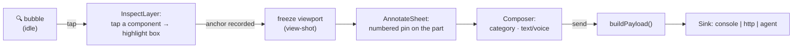
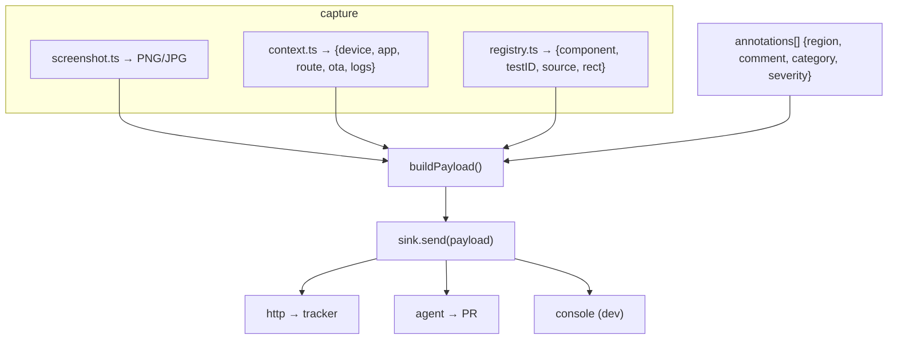

# Loupe — mobile app architecture

How the SDK in [`src/loupe`](../src/loupe) is structured, and how a tap becomes an actionable payload. Deep research behind every decision here: [`docs/design/screenshot-feedback-capture.md`](./design/screenshot-feedback-capture.md) and [`in-app-iteration-framework.md`](./design/in-app-iteration-framework.md).

## Module map

```
src/loupe/
├── index.ts              # public API
├── types.ts              # Payload, Annotation, Sink, LoupeConfig, RegisteredTarget
├── context.ts            # React context + internal state shape
├── LoupeProvider.tsx     # root wrapper: state machine, mounts bubble + overlay
├── FeedbackBubble.tsx    # draggable floating trigger (gesture-handler + reanimated)
├── overlay/
│   ├── FeedbackOverlay.tsx   # orchestrates: inspect → freeze → annotate → send
│   └── InspectLayer.tsx      # transparent hit-test layer; highlights the picked component
├── capture/
│   ├── screenshot.ts     # react-native-view-shot wrapper (+ limitations)
│   └── context.ts        # device / app / route / OTA / logs context bundle
├── registry/
│   ├── registry.ts       # component registry: register + measureInWindow hit-test
│   └── LoupeTarget.tsx    # <LoupeTarget>/useLoupeTarget — registers a node (collapsable=false)
├── annotate/
│   ├── AnnotateSheet.tsx # frozen image + pins
│   └── Composer.tsx      # category pills + text + (voice TODO)
├── payload/
│   └── buildPayload.ts   # assemble the normalized payload
├── sinks/
│   └── index.ts          # Sink interface + console / http / agent adapters
└── hooks/
    └── useLoupe.ts       # consumer hook
```

## The capture flow — "pick live, then freeze"



The reviewer taps the **live** UI (so we can read the real component), then we **freeze** to a still image so annotation happens on a stable canvas. Full UX rationale and the fallbacks (drag-a-region, point pin) are in [the capture design doc](./design/screenshot-feedback-capture.md).

## The anchor: how "which part" is resolved (dev vs release)

This is the crux, and it degrades gracefully by build type. **Never rely on React internals** — React 19 removed `fiber._debugSource`.

| Rank | Mechanism | Where | In this repo |
|---|---|---|---|
| 1 | `getInspectorDataForViewAtPoint` (tap → fiber + name) | **dev only** (throws in release) | `overlay/InspectLayer.tsx` (feature-detected) |
| 2 | Registry hit-test via `ref.measureInWindow()` | **release-safe** | `registry/registry.ts` (needs `collapsable={false}`) |
| 3 | `testID` encoding `file:line` | **release-safe** | read in `registry/LoupeTarget.tsx` |
| 4 | Babel-injected `data-loupe-source` prop | **release-safe** (if plugin on) | [`babel-plugin-loupe-source`](../babel-plugin-loupe-source) |
| — | fallback: raw tap coordinates + screenshot | always | `payload/buildPayload.ts` (`component: null`) |

So in a dev/preview build you get component name + props + `file:line`; in a store build you still get `testID`/`data-loupe-source` + measured rect + coordinates + screenshot. Consumers must tolerate `component: null`. Full matrix: [capture design doc §B8](./design/screenshot-feedback-capture.md).

## Data flow



The payload shape is defined in [`types.ts`](../src/loupe/types.ts) and mirrors [capture design doc §B7](./design/screenshot-feedback-capture.md).

## Native dependencies

`react-native-view-shot@^5` (Fabric-safe capture) · `@shopify/react-native-skia` (annotation drawing) · `react-native-gesture-handler` + `react-native-reanimated` (bubble drag, gestures) · `react-native-root-siblings` (root overlay) · `react-native-network-logger` (context) · `expo-device` / `expo-constants` (context). All are config-plugin / autolinked and wired by `expo prebuild` — they need a dev/custom build, not Expo Go. See [Expo vs bare RN notes](./design/screenshot-feedback-capture.md).

## What's real vs scoped-stub (experiment status)

- **Real & runnable:** provider + state machine, draggable bubble, screenshot capture, context bundle, component registry + hit-test, `LoupeTarget`, pin placement, category/text composer, payload assembly, console + HTTP sinks, the Babel source plugin.
- **Scoped stubs (documented inline):** Skia freehand/arrow drawing (`annotate/`), the dev-only `getInspectorDataForViewAtPoint` wiring (`overlay/InspectLayer.tsx`), voice notes, and destructive auto-redaction. Each has a `TODO(loupe)` with the approach and a pointer to the design doc.
